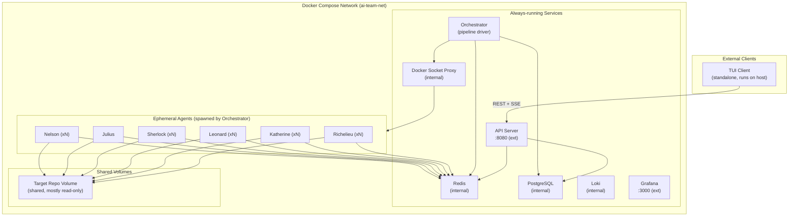
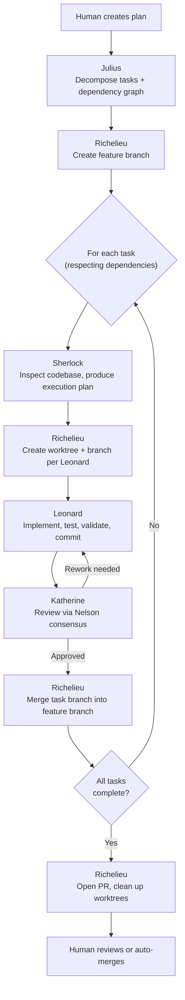

# 00 — Overview

> **Migrated from**: `PLAN.md` (vision, agents, tech stack, project structure, design decisions, phases) and `docs/specs/01-deployment.md` (container architecture diagram)

---

## 1. Vision

A multi-agent system that autonomously develops features for any codebase. The system
breaks down plans into tasks, enriches them with codebase context, implements them in
parallel, reviews the output through multi-LLM consensus, and learns from human feedback
to decide when to escalate.

The system is **provider-agnostic** — every critical decision passes through a consensus
loop where Claude, GPT, and Gemini cross-review each other until they converge.

---

## 2. Agent Roster

| Agent | Role | Key Responsibility |
|-------|------|-------------------|
| **Nelson** | Consensus Orchestrator | Runs the multi-LLM consensus loop (Claude + GPT-4o + Gemini) for any decision or evaluation. Used by all other agents when they need a high-confidence decision. See [spec 16](16-nelson.md). |
| **Julius** | Task Decomposer | Takes a high-level plan and decomposes it into minimal, independent tasks with a dependency graph. See [spec 17](17-julius.md). |
| **Sherlock** | Task Enricher / Investigator | Deeply inspects the codebase for a single task and produces a mini execution plan with file-level precision. See [spec 19](19-sherlock.md). |
| **Leonard** | Implementer | Takes an execution plan and implements the code changes, runs tests/linting, validates against acceptance criteria. Can run in parallel. See [spec 20](20-leonard.md). |
| **Katherine** | Code Reviewer | Reviews implementations via Nelson consensus, decides whether human review is needed using adaptive scoring. See [spec 21](21-katherine.md). |
| **Richelieu** | Git & Workspace Manager | Manages all git operations: feature branches, worktrees, merging, conflict resolution, PR creation. See [spec 18](18-richelieu.md). |
| **Orchestrator** | Pipeline Orchestrator (no LLM) | Deterministic event router that drives the entire pipeline lifecycle. Spawns and monitors all agent containers. See [spec 13](13-orchestrator.md). |

---

## 3. Container Architecture



---

## 4. Pipeline Flow



---

## 5. Spec Index

All detailed specifications live in this directory. Each spec is the canonical
reference for its domain.

| Spec | File | Summary |
|------|------|---------|
| 00 | [`00-overview.md`](00-overview.md) | This document. Vision, agent roster, architecture, tech stack, phases. |
| 01 | [`01-workflow.md`](01-workflow.md) | Pipeline lifecycle, branching model, 20-step event flow, dependency dispatch. |
| 02 | [`02-data-models.md`](02-data-models.md) | All Pydantic models, PostgreSQL schema, complete type catalog. |
| 03 | [`03-learning-and-principles.md`](03-learning-and-principles.md) | Learning mode, principle system, adaptive review threshold. |
| 04 | [`04-communication.md`](04-communication.md) | Redis Streams, consumer groups, message envelopes, dead letter queue. |
| 05 | [`05-infrastructure.md`](05-infrastructure.md) | Docker Compose, networking, volumes, Launcher Protocol, image builds, resource limits. |
| 06 | [`06-observability.md`](06-observability.md) | structlog, JSON lines, correlation IDs, event types catalog, audit trail. |
| 07 | [`07-cost-tracking.md`](07-cost-tracking.md) | Per-LLM-call attribution, budget limits (soft/hard), daily ceiling. |
| 08 | [`08-error-recovery.md`](08-error-recovery.md) | Checkpoints, 3 retries, escalation, idempotency. |
| 09 | [`09-security.md`](09-security.md) | Secrets, container hardening, filesystem permissions, prompt injection defense. |
| 10 | [`10-testing.md`](10-testing.md) | Record/replay (VCR), unit/integration/E2E pyramid, CI stages. |
| 11 | [`11-dev-standards.md`](11-dev-standards.md) | ruff + mypy strict + 90% coverage, coding conventions, CI pipeline. |
| 12 | [`12-repo-connection.md`](12-repo-connection.md) | GitHub App + PAT auth, cloning, webhooks, `.ai-team.yaml` full spec. |
| 13 | [`13-orchestrator.md`](13-orchestrator.md) | Pipeline orchestrator: event router, container launcher, watchdog, dependency dispatch. |
| 14 | [`14-api-server.md`](14-api-server.md) | REST + SSE API for TUI client, authentication, endpoints. |
| 15 | [`15-tui.md`](15-tui.md) | TUI (Textual) with pipeline, task, log, consensus, and cost views. |
| 16 | [`16-nelson.md`](16-nelson.md) | Nelson deep dive: consensus algorithm, weight learning, prompt templates, cost optimization. |
| 17 | [`17-julius.md`](17-julius.md) | Julius deep dive: plan intake, codebase analysis, task decomposition, dependency graph. |
| 18 | [`18-richelieu.md`](18-richelieu.md) | Richelieu deep dive: git operations, worktree management, PR creation, conflict resolution. |
| 19 | [`19-sherlock.md`](19-sherlock.md) | Sherlock deep dive: codebase inspection, execution plan generation. |
| 20 | [`20-leonard.md`](20-leonard.md) | Leonard deep dive: code implementation, test execution, validation, simplification. |
| 21 | [`21-katherine.md`](21-katherine.md) | Katherine deep dive: code review, human review scoring, adaptive threshold. |

---

## 6. Tech Stack

| Layer | Technology | Purpose |
|-------|------------|---------|
| Agent framework | PydanticAI | Typed agents, tool use, structured I/O |
| LLM routing | LiteLLM + OpenRouter | Single API key, unified access to all LLM providers |
| Task queue | Redis (streams or pub/sub) | Pipeline communication, task dispatch |
| Durable state | PostgreSQL (asyncpg) | Durable state, concurrent access from all containers |
| Git operations | GitPython + subprocess | Branch/worktree management |
| GitHub integration | PyGithub / `gh` CLI | Issue intake, PR creation, comments |
| Containerization | Docker + Docker Compose | Agent isolation |
| Dev workflow | Makefile | Build, test, run, logs |
| Package management | uv | Fast dependency management |
| Logging | structlog | Structured JSON logging |
| Dashboard | TUI (Textual) + Grafana/Loki | Real-time TUI + log inspection |
| Testing | pytest + testcontainers + VCR | Agent and integration testing |
| Log aggregation | Grafana + Loki | Structured log querying, dashboards, alerting |

---

## 7. Project Structure

All packages use the `ai_team` **namespace package** (PEP 420). Each workspace member
contains an `ai_team/` directory with **no `__init__.py`** — Python merges them at runtime.
Tests are colocated with each package. Integration tests live at the top level.

```
ai-team/
├── PLAN.md
├── Makefile
├── docker-compose.yml
├── pyproject.toml                     # Root uv workspace config
├── uv.lock
│
├── core/                              # Shared library
│   ├── pyproject.toml                 # name = "ai-team-core"
│   ├── ai_team/                       # Namespace package (no __init__.py)
│   │   └── core/
│   │       ├── __init__.py
│   │       ├── models/
│   │       │   ├── __init__.py
│   │       │   ├── task.py            # Task, ExecutionPlan, DependencyGraph
│   │       │   ├── review.py          # ReviewResult, HumanReviewScore
│   │       │   └── config.py          # .ai-team.yaml schema
│   │       ├── queue/
│   │       │   ├── __init__.py
│   │       │   └── redis.py           # Redis Streams abstraction
│   │       ├── state/
│   │       │   ├── __init__.py
│   │       │   └── store.py           # PostgreSQL state management (asyncpg)
│   │       ├── migrations/
│   │       │   ├── 001_initial.sql
│   │       │   └── runner.py          # Lightweight migration runner
│   │       ├── git/
│   │       │   ├── __init__.py
│   │       │   └── workspace.py       # Git/worktree operations
│   │       ├── scoring/
│   │       │   ├── __init__.py
│   │       │   └── confidence.py      # Adaptive confidence scoring
│   │       ├── llm/
│   │       │   ├── __init__.py
│   │       │   ├── client.py          # LiteLLM wrapper, provider config
│   │       │   └── consensus.py       # Nelson's consensus engine
│   │       └── logging/
│   │           ├── __init__.py
│   │           └── setup.py           # structlog configuration
│   └── tests/
│       ├── conftest.py
│       ├── test_models.py
│       ├── test_queue.py
│       ├── test_state.py
│       └── test_migrations.py
│
├── orchestrator/                      # Pipeline orchestrator (always-running)
│   ├── pyproject.toml                 # name = "ai-team-orchestrator"
│   ├── Dockerfile
│   ├── ai_team/                       # Namespace package (no __init__.py)
│   │   └── orchestrator/
│   │       ├── __init__.py
│   │       ├── main.py               # Entry point, event loop
│   │       ├── config.py             # OrchestratorConfig (Pydantic settings)
│   │       ├── router.py             # Event → handler dispatch table
│   │       ├── state.py              # Pipeline/task state transitions
│   │       ├── launcher.py           # Docker container spawning
│   │       ├── watchdog.py           # Heartbeat monitoring
│   │       └── graph.py              # DependencyGraph, get_ready_tasks()
│   └── tests/
│       ├── conftest.py
│       ├── test_router.py
│       ├── test_launcher.py
│       ├── test_state.py
│       └── test_graph.py
│
├── api/                               # REST + SSE API server (always-running)
│   ├── pyproject.toml                 # name = "ai-team-api"
│   ├── Dockerfile
│   ├── ai_team/                       # Namespace package (no __init__.py)
│   │   └── api/
│   │       ├── __init__.py
│   │       ├── main.py               # FastAPI app
│   │       ├── config.py
│   │       ├── auth.py               # Token authentication
│   │       ├── schemas.py            # Request/response Pydantic models
│   │       └── routes/
│   │           ├── __init__.py
│   │           ├── pipelines.py      # Pipeline CRUD + plan submission
│   │           ├── tasks.py          # Task status, details
│   │           ├── events.py         # SSE endpoint (live streaming)
│   │           └── health.py
│   └── tests/
│       ├── conftest.py
│       ├── test_routes.py
│       └── test_auth.py
│
├── tui/                               # Interactive TUI client (runs on host)
│   ├── pyproject.toml                 # name = "ai-team-tui" (pip-installable, no Dockerfile)
│   ├── ai_team/                       # Namespace package (no __init__.py)
│   │   └── tui/
│   │       ├── __init__.py
│   │       ├── app.py                # Textual app entry point
│   │       ├── config.py             # Connection settings (API URL, token)
│   │       ├── client.py             # API client (REST + SSE consumer)
│   │       ├── screens/
│   │       │   ├── __init__.py
│   │       │   ├── dashboard.py      # Main overview: pipelines, agents, costs
│   │       │   ├── pipeline.py       # Single pipeline detail view
│   │       │   ├── plan.py           # Plan submission (chat-like interface)
│   │       │   ├── tasks.py          # Task list + dependency graph
│   │       │   ├── consensus.py      # Nelson consensus debate viewer
│   │       │   ├── logs.py           # Filterable log viewer
│   │       │   └── settings.py       # Connection config, preferences
│   │       └── widgets/
│   │           ├── __init__.py
│   │           ├── agent_status.py   # Live agent status indicators
│   │           ├── dep_graph.py      # Dependency graph visualization
│   │           ├── log_panel.py      # Scrolling, filterable log panel
│   │           ├── cost_bar.py       # Budget usage indicator
│   │           └── streaming.py      # SSE-backed live update widget
│   └── tests/
│       ├── conftest.py
│       ├── test_client.py
│       └── test_screens.py
│
├── agents/                            # Ephemeral agent packages
│   ├── nelson/
│   │   ├── pyproject.toml             # name = "ai-team-nelson"
│   │   ├── Dockerfile
│   │   ├── ai_team/                   # Namespace package (no __init__.py)
│   │   │   └── nelson/
│   │   │       ├── __init__.py
│   │   │       └── agent.py           # Consensus loop orchestration
│   │   └── tests/
│   │       └── test_consensus.py
│   │
│   ├── julius/
│   │   ├── pyproject.toml
│   │   ├── Dockerfile
│   │   ├── ai_team/
│   │   │   └── julius/
│   │   │       ├── __init__.py
│   │   │       └── agent.py           # Task decomposition + dependency graph
│   │   └── tests/
│   │       └── test_decomposition.py
│   │
│   ├── sherlock/
│   │   ├── pyproject.toml
│   │   ├── Dockerfile
│   │   ├── ai_team/
│   │   │   └── sherlock/
│   │   │       ├── __init__.py
│   │   │       └── agent.py           # Codebase analysis + execution planning
│   │   └── tests/
│   │       └── test_enrichment.py
│   │
│   ├── leonard/
│   │   ├── pyproject.toml
│   │   ├── Dockerfile
│   │   ├── ai_team/
│   │   │   └── leonard/
│   │   │       ├── __init__.py
│   │   │       └── agent.py           # Implementation + testing + validation
│   │   └── tests/
│   │       └── test_implementation.py
│   │
│   ├── katherine/
│   │   ├── pyproject.toml
│   │   ├── Dockerfile
│   │   ├── ai_team/
│   │   │   └── katherine/
│   │   │       ├── __init__.py
│   │   │       └── agent.py           # Code review + human review scoring
│   │   └── tests/
│   │       └── test_review.py
│   │
│   └── richelieu/
│       ├── pyproject.toml
│       ├── Dockerfile
│       ├── ai_team/
│       │   └── richelieu/
│       │       ├── __init__.py
│       │       └── agent.py           # Git/workspace management
│       └── tests/
│           └── test_git_ops.py
│
└── tests/                             # Integration tests only (cross-package)
    ├── conftest.py                    # testcontainers fixtures (Redis, PostgreSQL)
    ├── integration/
    │   ├── test_pipeline_e2e.py       # Full pipeline: plan → PR
    │   ├── test_consensus_e2e.py
    │   └── test_api_sse.py
    └── cassettes/                     # VCR recordings for LLM calls
```

---

## 8. `.ai-team.yaml` Specification

This file lives in the root of any target repository and tells the agents how to work
with that codebase. See [spec 12](12-repo-connection.md) for the full connection and configuration details.

```yaml
# .ai-team.yaml
version: "1"

project:
  name: "my-app"
  description: "Brief description of what this project does"
  language: "python"                  # Primary language
  framework: "fastapi"               # Primary framework (optional)

# Where to find codebase knowledge
knowledge:
  architecture_docs: "docs/architecture.md"
  api_docs: "docs/api/"
  style_guide: "docs/STYLE_GUIDE.md"
  adr_directory: "docs/adr/"          # Architecture Decision Records
  additional:
    - "CONTRIBUTING.md"
    - "docs/patterns.md"

# Commands the agents should use
commands:
  install: "uv sync"
  test: "uv run pytest"
  lint: "uv run ruff check ."
  format: "uv run ruff format ."
  type_check: "uv run mypy src/"
  build: "uv run python -m build"

# Rules the agents must follow
guidelines:
  - "All functions must have type annotations"
  - "Test coverage must not decrease"
  - "No direct database queries outside the repository layer"
  - "Use structured logging, never print()"
  - "Follow conventional commits for commit messages"

# Branches
git:
  default_branch: "main"
  branch_prefix: "ai-team/"          # All AI-created branches use this prefix
  require_pr: true
  auto_merge: false                   # Even if Katherine approves, don't auto-merge

# Budget limits
budget:
  soft_limit: 5.00                    # Warn when pipeline exceeds this ($)
  hard_limit: 20.00                   # Halt pipeline at this cost ($)

# LLM configuration
llm:
  default_model: anthropic/claude-sonnet-4
  consensus:
    models:
      - anthropic/claude-sonnet-4
      - openai/gpt-4o
      - google/gemini-2.0-flash
    max_rounds: 3
  overrides:                                 # Optional: per-agent model override
    leonard: anthropic/claude-sonnet-4

# Scoring overrides
review:
  human_review_threshold: 0.7         # Score above this → human review required
  always_human_review:
    - "migrations/"                   # Always flag changes to these paths
    - "infrastructure/"
    - "*.sql"
```

---

## 9. Implementation Phases

### Phase 0 -- Foundation (Week 1-2)
> Get the skeleton standing. No AI yet -- just infrastructure.

- [ ] Initialize uv workspace with root `pyproject.toml`.
- [ ] Set up `core/` package structure.
- [ ] Implement Redis queue abstraction (`core/queue/`).
- [ ] Implement PostgreSQL state store (asyncpg) with migration runner (`core/state/`, `core/migrations/`).
- [ ] Implement full LiteLLM + OpenRouter client wrapper (`core/llm/client.py`).
- [ ] Implement structlog configuration (`core/logging/`).
- [ ] Define Pydantic models for tasks, reviews, configs (`core/models/`).
- [ ] Parse `.ai-team.yaml` into typed config.
- [ ] Set up Docker Compose (Redis, PostgreSQL, Loki, Grafana).
- [ ] Set up Makefile (build, test, up, down, logs).
- [ ] Set up pytest with basic test infrastructure.

### Phase 1 -- Orchestrator (Week 3)
> The conductor. No LLM -- pure infrastructure that launches and monitors everything.

- [ ] Scaffold `orchestrator/` package (config, state tracker, launcher, watchdog, router).
- [ ] Implement `OrchestratorConfig` (Pydantic settings from environment).
- [ ] Implement `pipelines` and `active_containers` PostgreSQL tables + migrations.
- [ ] Implement `StateTracker` (pipeline CRUD, container lifecycle, task status).
- [ ] Implement `Launcher` with Docker SDK (launch, stop, inspect, wait, remove).
- [ ] Implement `Watchdog` loop (heartbeat monitoring, dead container detection, retry vs. escalate).
- [ ] Implement `Router` with full event → handler dispatch table.
- [ ] Implement pipeline lifecycle state machine (created → decomposing → in_progress → completing → completed/failed).
- [ ] Implement dependency graph dispatch (get_ready_tasks → launch Sherlocks on batch).
- [ ] Implement failure recovery flows (retry, escalate, pause pipeline).
- [ ] Add orchestrator to Docker Compose (with Docker socket proxy).
- [ ] Write unit tests for all components (mock Docker SDK, mock Redis).
- [ ] Write integration tests with Redis + mock containers.

### Phase 2 -- Nelson: The Consensus Engine (Week 4)
> The heart of the system. Everything else depends on this.

- [ ] Implement parallel LLM prompt dispatch (Claude + GPT + Gemini).
- [ ] Implement cross-review round logic.
- [ ] Implement hybrid termination (majority → weighted → escalate).
- [ ] Implement provider weight storage and learning.
- [ ] Implement consensus result model with confidence score.
- [ ] Add structured logging for every consensus round.
- [ ] Write unit tests with mocked LLM responses.
- [ ] Write integration test with real LLM calls.
- [ ] Dockerize Nelson.

### Phase 3 -- Richelieu: Git Backbone (Week 5)
> Without git management, no agent can do real work.

- [ ] Implement feature branch creation.
- [ ] Implement worktree creation/cleanup per task.
- [ ] Implement branch merging (task → feature).
- [ ] Implement conflict detection and escalation.
- [ ] Implement PR creation via GitHub API.
- [ ] Implement branch alignment on upstream merge.
- [ ] Add safety guards on destructive operations.
- [ ] Write tests against a test git repo.
- [ ] Dockerize Richelieu.

### Phase 4 -- Julius: Task Decomposition (Week 6-7)
> Turn plans into parallelizable work.

- [ ] Implement plan intake (parse plan from GitHub issue or direct input).
- [ ] Implement codebase high-level analysis (structure, modules, deps).
- [ ] Implement task decomposition with minimal-file-change constraint.
- [ ] Implement dependency graph builder.
- [ ] Integrate Nelson for decomposition validation.
- [ ] Output task list to Redis queue.
- [ ] Write tests with sample plans and expected decompositions.
- [ ] Dockerize Julius.

### Phase 5 -- Sherlock: Task Enrichment (Week 8)
> Deep codebase understanding for each task.

- [ ] Implement targeted codebase reading (files, functions, patterns).
- [ ] Implement mini execution plan generation.
- [ ] Integrate with `.ai-team.yaml` guidelines.
- [ ] Integrate Nelson for ambiguous approach resolution.
- [ ] Write tests with sample tasks and expected execution plans.
- [ ] Dockerize Sherlock.

### Phase 6 -- Leonard: Implementation (Week 9-10)
> The coding agent. Most complex, most risk.

- [ ] Implement code generation from mini execution plan.
- [ ] Implement test execution (run commands from `.ai-team.yaml`).
- [ ] Implement lint/format execution.
- [ ] Implement validation against acceptance criteria.
- [ ] Implement retry logic (max N attempts).
- [ ] Implement code simplification pass.
- [ ] Implement escalation on persistent failure.
- [ ] Integration with Richelieu for worktree lifecycle.
- [ ] Write tests with controlled codebases and expected outputs.
- [ ] Dockerize Leonard (needs code execution capabilities).

### Phase 7 -- Katherine: Code Review (Week 11)
> Quality gate with adaptive human escalation.

- [ ] Implement diff analysis.
- [ ] Integrate Nelson for multi-LLM code review consensus.
- [ ] Implement review feedback → Leonard rework loop.
- [ ] Implement human review scoring (novelty, complexity, confidence).
- [ ] Implement scoring via Nelson consensus.
- [ ] Implement adaptive threshold learning.
- [ ] Record human decisions for threshold calibration.
- [ ] Write tests for scoring edge cases.
- [ ] Dockerize Katherine.

### Phase 8 -- API Server (Week 12)
> The interface between external clients and the system.

- [ ] Scaffold `api/` package with FastAPI.
- [ ] Implement REST endpoints: pipeline CRUD, task status, plan submission.
- [ ] Implement SSE endpoint for real-time event streaming.
- [ ] Implement token authentication.
- [ ] Define request/response Pydantic schemas.
- [ ] Add API server to Docker Compose.
- [ ] Write endpoint tests.

### Phase 9 -- TUI (Week 13-14)
> Rich interactive terminal interface — the primary way humans interact with the system.

- [ ] Scaffold `tui/` package with Textual.
- [ ] Implement API client (REST + SSE consumer).
- [ ] Implement dashboard screen: pipeline overview, agent status, cost summary.
- [ ] Implement plan submission screen with chat-like interface.
- [ ] Implement task list with dependency graph visualization.
- [ ] Implement consensus debate viewer.
- [ ] Implement real-time log viewer with filtering.
- [ ] Implement SSE-backed live update widgets.
- [ ] Build custom widgets (agent status, dep graph, cost bar, log panel).
- [ ] Make pip-installable (`pip install ai-team-tui`).

### Phase 10 -- End-to-End Integration (Week 15-16)
> Wire everything together and prove it works.

- [ ] End-to-end integration test with a real repo and real LLM calls.
- [ ] Verify orchestrator drives full pipeline (plan → PR) with all agents.
- [ ] Test TUI → API → orchestrator → agents → PR flow.
- [ ] Error handling and graceful degradation across the pipeline.
- [ ] GitHub webhook integration for issue intake.

### Phase 11 -- Hardening & Polish (Week 17+)
> Production-readiness.

- [ ] Rate limiting for LLM API calls.
- [ ] Cost tracking per pipeline run.
- [ ] Retry / circuit breaker for external API calls.
- [ ] Graceful shutdown handling for all agents.
- [ ] Documentation (setup guide, architecture overview, config reference).
- [ ] CI pipeline for the ai-team repo itself.
- [ ] Security review (secrets handling, container permissions).

### Dog-fooding

Once stable, prove the system by rebuilding ai-team in a fresh repo using this
documentation as input. This tests the full pipeline on a real complex project
and validates documentation quality.

---

## 10. Key Design Decisions

| Decision | Choice | Rationale |
|----------|--------|-----------|
| Agent isolation | Docker containers (each agent) | Safety -- Leonard runs arbitrary code. Blast radius control. |
| Communication | Redis Streams + dead letter queue | Durable, replayable, supports consumer groups for parallel Leonards. |
| Nelson integration | Also via Redis (everything through Redis) | Single communication backbone. No direct container-to-container calls. |
| State storage | Redis + PostgreSQL (asyncpg) | Redis for ephemeral/real-time, PostgreSQL for durable data. Proper concurrent access from all containers. |
| LLM routing | LiteLLM + OpenRouter | Single API key, single billing source. Adding models is a config change. |
| LLM providers | Claude + GPT-4o + Gemini (via OpenRouter) | Three providers for robust consensus. Single API key via OpenRouter. |
| Agent framework | PydanticAI | Typed tool use, structured outputs, minimal magic. Maximum control. |
| Consensus termination | Hybrid (majority → weighted → human) | Balances speed (quick consensus) with accuracy (weighted tiebreak) and safety (human escalation). |
| Consensus output | Structured decision + free reasoning | JSON envelope for programmatic comparison + freeform reasoning for nuance. |
| Message protocol | Strict Pydantic models (versioned) | Type-safe serialization/deserialization with validation at every boundary. |
| Task sizing | Minimum file changes | Speeds up Leonard, simplifies Katherine's review, reduces merge conflicts. |
| Parallelism | Julius-managed dependency graph | Smart parallelism -- not just "run everything at once" but respecting dependencies. |
| Human review scoring | Nelson consensus (all 3 LLMs score it) | Same rigor as code review. Scores novelty, complexity, risk, AI confidence. |
| Human review | Adaptive threshold learning | Starts conservative, learns the team's standards from human feedback. |
| GitHub auth | GitHub App + PAT fallback | GitHub App for orgs (auto-refresh), PAT for personal repos. |
| Project config | `.ai-team.yaml` per repo | Clean interface between the agent system and any target codebase. |
| Package management | uv workspaces | Fast, modern Python tooling. Workspace support for monorepo. |
| Package namespace | `ai_team.*` (PEP 420 namespace packages) | Unified imports: `ai_team.core`, `ai_team.orchestrator`, `ai_team.nelson`, etc. Flat layout (no `src/`). |
| Client architecture | API Server (Docker) + TUI (host) | API is the sole external interface. TUI is a standalone pip-installable Textual app, connects via REST + SSE. |
| Filesystem access | All agents read repo, only Leonard + Richelieu write | Everyone can analyze the codebase. Write permissions are restricted. |
| Observability UI | TUI (Textual) + Grafana/Loki | TUI for real-time, Grafana for historical log querying and dashboards. |
| Logging | Everything, always (structlog + JSON) | Full replay capability. Correlation IDs trace across agents. |
| Cost tracking | Per LLM call, configurable budget limits | Soft limits warn, hard limits halt. Daily hard ceiling as safety net. |
| Error recovery | Checkpoint + 3 retries + escalate | Resume from last checkpoint, alert human, max 3 retries. |
| Testing | testcontainers + VCR cassettes | Real Redis and PostgreSQL via testcontainers. VCR for LLM recordings. No mocks. |
| Dev standards | Strict (ruff + mypy strict + 90%+ coverage) | High quality bar for the system that writes code for others. |
| Secrets | .env files (gitignored) | Simple, no infrastructure overhead. Single OPENROUTER_API_KEY instead of multiple provider keys. Per-agent secret scoping. |
| Deployment | Docker Compose + Makefile | Makefile for dev workflow, Compose for service orchestration. |
| Log aggregation | Grafana + Loki | Docker logging driver ships all logs to Loki. Zero-config per agent. |
| LLM config | .ai-team.yaml (not env vars) | Target repo owner decides model preferences. Secrets (.env) separate from config. |
| Health checks | Redis heartbeats | No HTTP servers in agents. Orchestrator watchdog monitors heartbeats. |
| DB migrations | Numbered SQL files + runner | Simple, no heavy deps (no Alembic). Works with asyncpg. |
| Dog-fooding | Once stable | Prove the system by rebuilding ai-team in a fresh repo using the documentation as input. |
