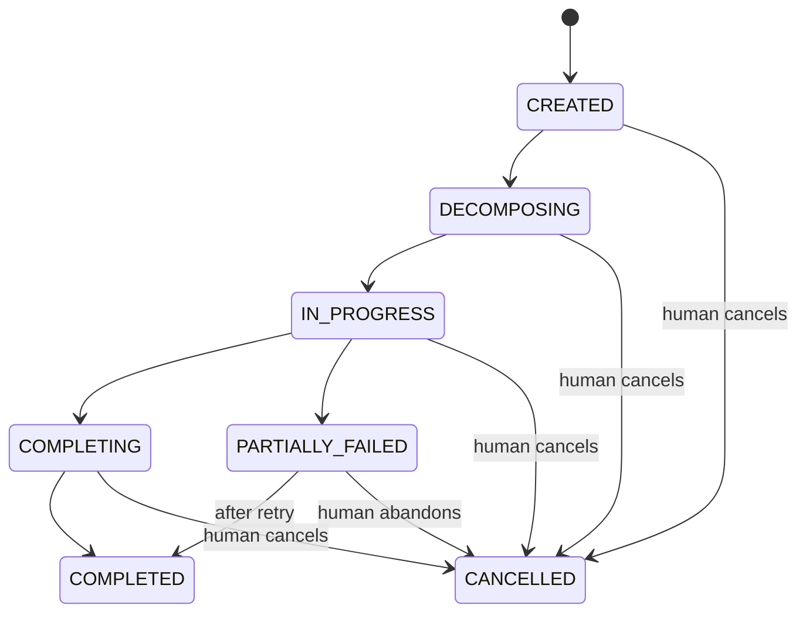
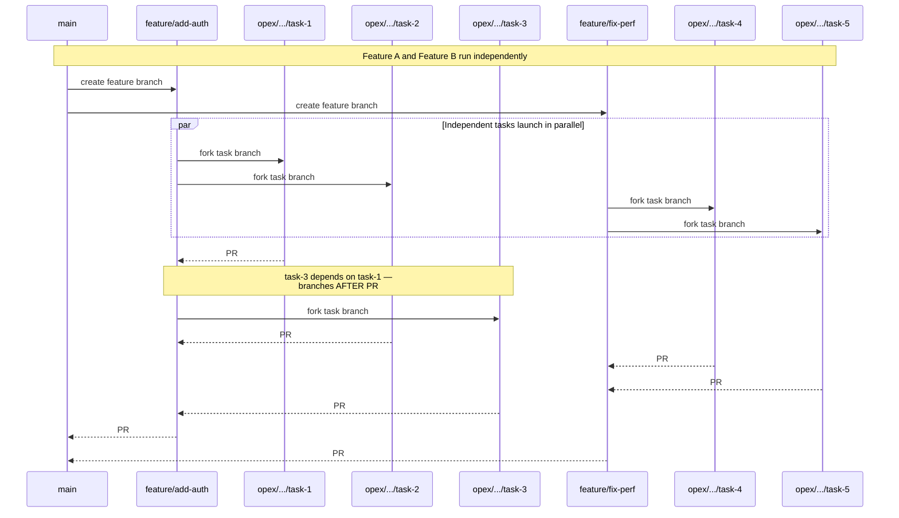
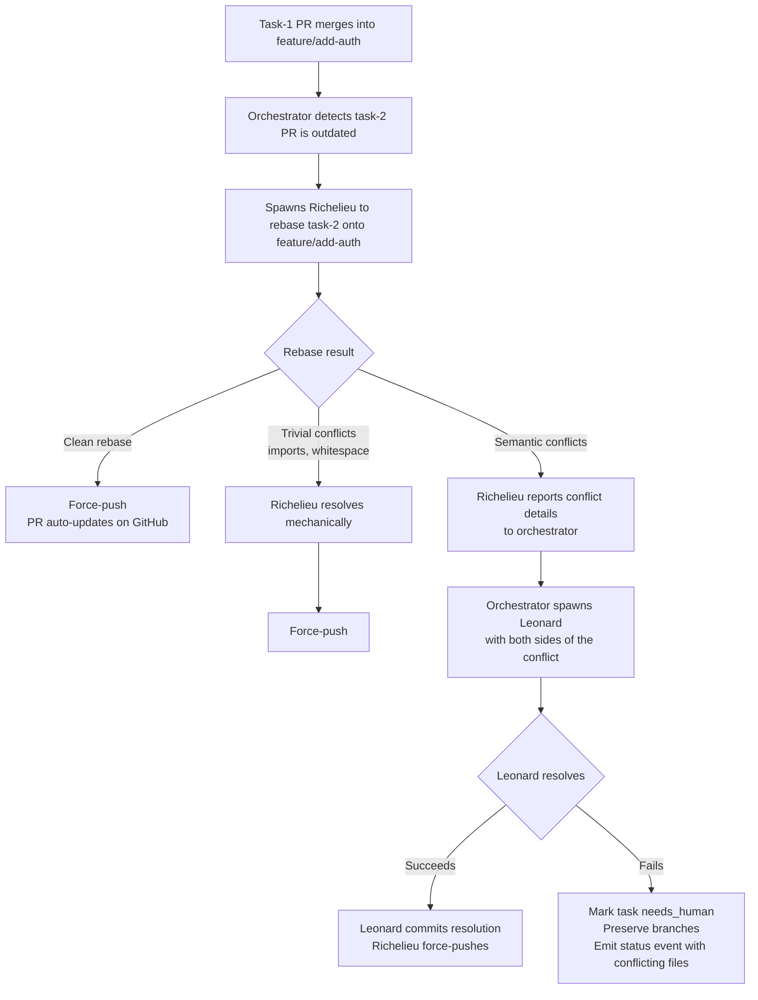
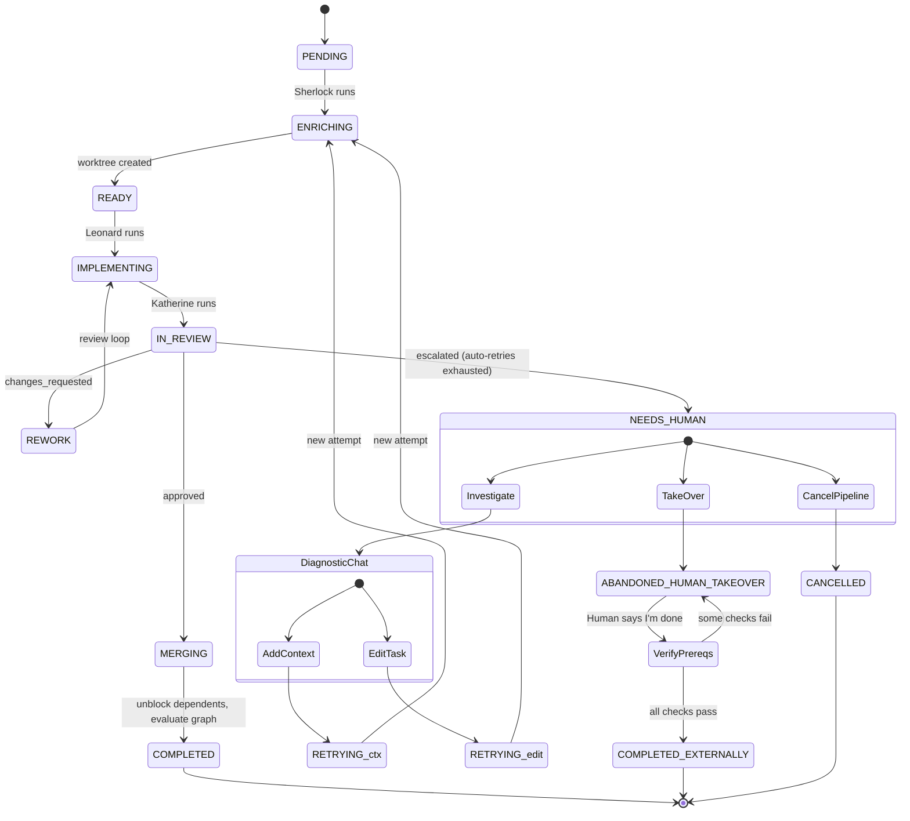
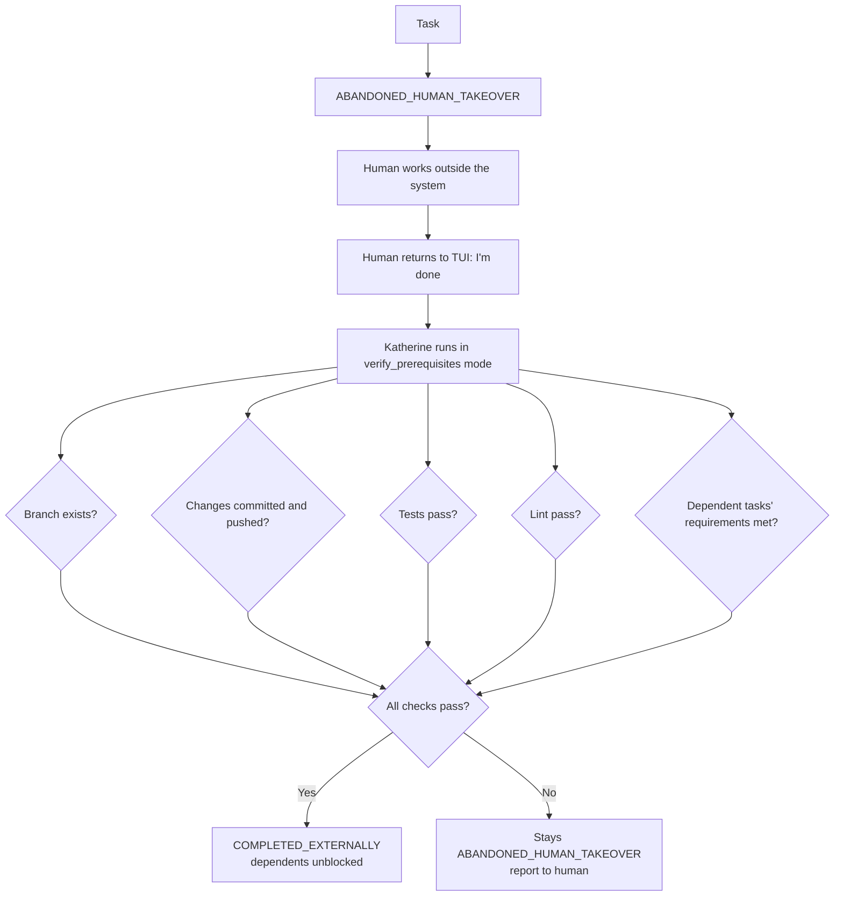
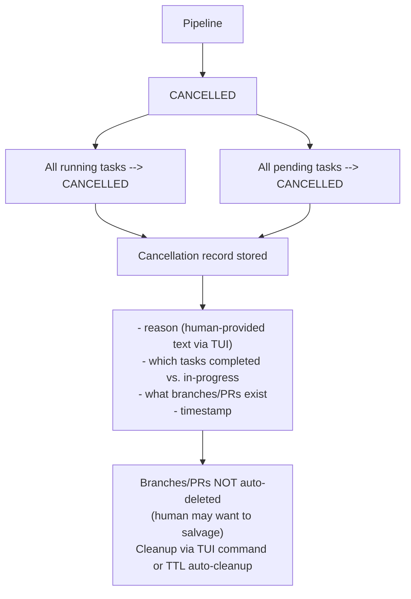
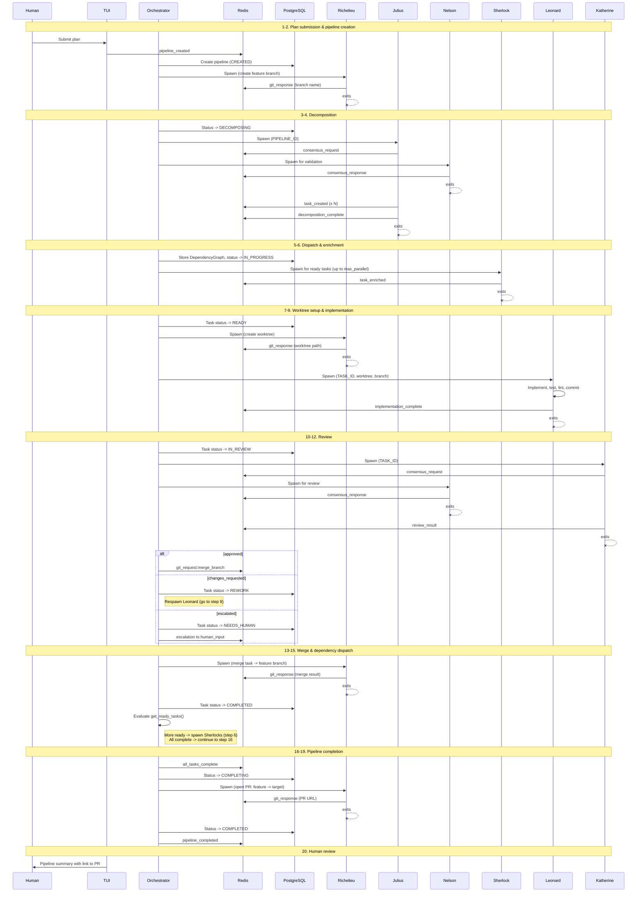

# 01 — Workflow

> **Migrated from**: `docs/specs/01-deployment.md` (Branching Model & Repo Lifecycle, Review Flow, Conflict Resolution, GitHub Labels) and `docs/specs/13-orchestrator.md` (Complete Event Flow: End-to-End Pipeline, 20-step walkthrough)

---

## Overview

This spec defines the complete pipeline lifecycle from plan submission to merged PR.
It covers the branching model, the worktree layout, the review flow, and the full
20-step event walkthrough that drives a pipeline from start to finish.

For the orchestrator that orchestrates these events, see spec 13.
For the communication protocol (Redis Streams), see spec 04.
For git operations (Richelieu), see spec 18.

---

## Pipeline Lifecycle

A pipeline transitions through these states:



| Status | Description |
|--------|-------------|
| `CREATED` | Plan received, not yet started |
| `DECOMPOSING` | Julius is running |
| `IN_PROGRESS` | Tasks are being processed |
| `COMPLETING` | All tasks done, opening PR |
| `COMPLETED` | PR opened |
| `PARTIALLY_FAILED` | Some tasks succeeded, some need human intervention. Pipeline can recover via retry or human takeover. |
| `CANCELLED` | Explicitly cancelled by human |

> **Design principle (P8 — No Silent Failures):** There is no automatic
> `FAILED` terminal state for pipelines. The system never gives up
> autonomously. Every failure escalates to a human who can retry with
> more context, take over manually, or explicitly cancel. The only way
> a pipeline terminates without success is by explicit human decision
> (`CANCELLED`).

---

## Branching Model

### Repo volume lifecycle

1. **`make connect REPO=<url>`** -- Clones the target repo into the `opex-repo`
   volume. This is a one-time setup operation. The clone persists across pipelines
   (warm cache).

2. **Pipeline starts** -- Richelieu runs `git fetch origin` to pull the latest
   changes, then creates a feature branch from `origin/{default_branch}` (the
   default branch is configured in `.opex.yaml`). The feature branch is pushed
   to GitHub.

3. **Task starts** -- Richelieu creates a worktree + task branch from the feature
   branch HEAD. The task branch is pushed to GitHub.

4. **Task PR** -- Richelieu opens a GitHub PR from the task branch targeting the
   feature branch. All review happens on this PR (see Review Flow below).

5. **Task complete** -- After the PR is merged on GitHub, Richelieu pulls the
   updated feature branch locally. The worktree is cleaned up.

6. **All tasks complete** -- Richelieu opens a **feature PR** from the feature
   branch targeting the default branch (`main`). This is the integration review.

7. **Between pipelines** -- The repo volume persists. The next pipeline starts
   with `git fetch`, so it has the latest upstream state.

### Branching structure



### Branching rules

1. **All task branches fork from the feature branch HEAD** at the time the task
   starts.
2. **All task PRs target the feature branch** (not `main`).
3. **Dependent tasks wait**: If task-3 depends on task-1, task-3 doesn't start
   until task-1's PR is merged into the feature branch. This ensures task-3
   branches from a feature branch that already contains task-1's code.
4. **Independent tasks run in parallel**: Tasks with no dependency edges can
   start simultaneously. Their PRs may need rebasing (see Conflict Resolution).
5. **One feature PR at the end**: When all task PRs are merged, Richelieu opens
   a single PR from the feature branch to the default branch.
6. **Multiple features are independent**: Different features use different
   feature branches. They share the same git clone (objects are shared) but
   their worktrees and branches don't interfere.

---

## Worktree Layout

```
/workspace/                              # Main clone, checked out on default branch
/workspace/.worktrees/
  add-auth--task-1/                      # Worktree on opex/add-auth/task-1
  add-auth--task-2/                      # Worktree on opex/add-auth/task-2
  fix-perf--task-4/                      # Worktree on opex/fix-perf/task-4
```

---

## Conflict Resolution

When parallel task PRs target the same feature branch, merging one may cause
the other to become outdated or have conflicts.



Richelieu handles trivial conflicts (non-overlapping hunks, imports, whitespace) mechanically.
For semantic conflicts — where both sides modified the same logic — the orchestrator spawns
Leonard with the conflict context (both diffs, both tasks' execution plans). Leonard has the
LLM and codebase understanding to reason about the correct resolution.

Katherine re-reviews if the rebase changed code (not just a clean fast-forward).

---

## Review Flow on Task PRs

Every task PR goes through this review flow on GitHub:

1. **Katherine** posts structured review comments on the PR (correctness,
   style, safety, simplicity). See spec 21 for Katherine's full review process.
2. **If changes needed**: Katherine requests changes. Leonard pushes fixes
   to the task branch. Katherine re-reviews. The full conversation is visible
   on the PR.
3. **Katherine calculates human review score** via Nelson consensus (see spec 16).
4. **If score < threshold**: Katherine approves the PR.
5. **If score >= threshold**: PR stays open, flagged for human review.
   A `learning-mode` label is added if learning mode is active (see spec 03).
6. **Human reviews** (if flagged): Approves, requests changes, or discusses.
   Human comments feed back into the principle system (see spec 03).

---

## GitHub Labels

| Label                    | Applied when                                    |
|--------------------------|-------------------------------------------------|
| `opex`               | All PRs created by the system                   |
| `learning-mode`         | Feature is in learning mode                     |
| `learning: replay-N`    | Task PR is the Nth replay in learning mode      |
| `autonomous`            | Task completed without human review             |
| `needs-human-review`    | Katherine flagged for human review              |

---

## Dependency Dispatch

The orchestrator evaluates the dependency graph after every task completion to
determine which tasks can be launched next. This is the core scheduling logic.

### How it works

1. When `branch_merged` event arrives (a task's PR was merged into the feature
   branch), the orchestrator marks that task as `COMPLETED`.

2. The orchestrator calls `DependencyGraph.get_ready_tasks()` which returns tasks
   whose dependencies are all completed and whose status is still `PENDING`:

   ```python
   def get_ready_tasks(self) -> list[Task]:
       """Returns tasks whose dependencies are all completed."""
       completed = {t.id for t in self.tasks if t.status == TaskStatus.COMPLETED}
       return [
           t for t in self.tasks
           if t.status == TaskStatus.PENDING
           and all(dep in completed for dep in t.depends_on)
       ]
   ```

3. For each newly ready task, the orchestrator spawns a Sherlock container to
   enrich it (beginning the Sherlock → Leonard → Katherine pipeline for that
   task).

4. The orchestrator publishes a `batch_dispatched` event tracking which tasks
   were launched in this batch.

5. If `get_ready_tasks()` returns empty AND all tasks are completed, the
   orchestrator transitions the pipeline to `COMPLETING` and spawns Richelieu
   to open the feature PR.

### Parallelism limits

The orchestrator respects per-agent parallelism limits (see spec 13 for
`OrchestratorConfig`):

- `max_parallel_sherlocks: 5`
- `max_parallel_leonards: 3`
- `max_parallel_katherines: 3`
- `max_parallel_nelsons: 5`
- `max_parallel_richelieus: 3` (serialized per-branch, parallel across branches)

If more tasks are ready than the parallelism limit allows, the orchestrator
queues them and launches as slots become available.

---

## Task Lifecycle

Each task in a pipeline transitions through these states:



Terminal states:
- `COMPLETED` -- system finished the task
- `COMPLETED_EXTERNALLY` -- human finished the task, Katherine verified
- `CANCELLED` -- human cancelled the pipeline

Non-terminal waiting states:
- `NEEDS_HUMAN` -- waiting for human decision
- `ABANDONED_HUMAN_TAKEOVER` -- human took over, doing work externally

> **Design principle (P8 — No Silent Failures):** There is no automatic
> `FAILED` terminal state for tasks. When auto-retries are exhausted, the
> task moves to `NEEDS_HUMAN`, not `FAILED`. The system always escalates
> to a human rather than silently giving up.

---

## Failure Handling

### Failure granularity: task-level

A single task failure does **not** fail the pipeline or kill sibling tasks.
Independent tasks continue running. The pipeline only enters
`PARTIALLY_FAILED` when all runnable work is done and at least one task
is stuck in `NEEDS_HUMAN` or `ABANDONED_HUMAN_TAKEOVER`.

### Retry mechanics

- **Retry count**: Configurable in `.opex.yaml` under `retries.max_task_retries`
  (default: 2 retries = 3 total attempts). Overridable per-pipeline from the TUI.
- **Retry strategy: from scratch.** Leonard makes a **single commit** at task
  completion — no intermediate commits. Julius creates tasks small enough
  that restarting is cheap. On retry, the previous attempt's branch work is
  discarded (branch reset to feature branch HEAD).
- **Retry trigger**: After the Leonard → Katherine review loop exhausts max
  review cycles (see Issue 11), or after an agent container crashes/OOMs
  and agent-level retries (spec 08) are exhausted.
- **After auto-retries exhausted**: Task → `NEEDS_HUMAN`. Always escalates,
  never auto-fails.

### Attempt history

Each task attempt is a separate record in PostgreSQL — never overwritten.
When retrying, a new attempt is created linked to the same task.

```
task_attempts table:
  id                 -- UUID
  task_id            -- FK to tasks
  attempt_number     -- 1-indexed
  status             -- 'running' | 'succeeded' | 'failed' | 'abandoned'
  started_at
  finished_at
  failure_reason     -- human-readable
  exit_code          -- agent container exit code (if applicable)
  agent_logs_ref     -- reference to logs in Loki
  diff_snapshot      -- git diff at time of failure (for inspection)
```

### External dependency failures

- **Redis/PostgreSQL down**: System-level concern, owned by spec 08 (Error
  Recovery). Orchestrator startup reconciliation handles recovery.
- **GitHub API down**: Task-level concern. Richelieu retries with exponential
  backoff (handled by agent retry mechanism in spec 08). After max agent-level
  retries → task escalates to `NEEDS_HUMAN`.

### Cleanup on failure

Failed attempts preserve branches and worktrees for human inspection.
Cleanup is manual via a TUI/API command, or automatic via configurable
TTL (default: 48 hours).

---

## Human Intervention Flow

When a task reaches `NEEDS_HUMAN`, the human has three options: investigate
and retry, take over manually, or cancel the entire pipeline.

### Option 1: Investigate and retry (diagnostic chat)

A two-phase process mediated by the TUI and API server.

**Phase 1 — Diagnostic Chat**

The human enters a chat session in the TUI (via API server → LLM). This is
**not** a new agent — it's a stateless conversation handled by the API server
calling the LLM directly (via LiteLLM/OpenRouter). The chat has access to:

- The failed task's attempt history (logs, diffs, failure reasons)
- The original task description and all context entries
- The current state of the codebase (relevant files)

The human and LLM discuss what went wrong, what's missing, and whether the
task is scoped correctly. No system state changes during this phase.

**At any point during the chat, the human can invoke Nelson consensus** to
get multi-model validation on a decision before committing to it. Nelson is
spawned through the normal orchestrator mechanism — the API server publishes
a `consensus_request` to Redis.

**Phase 2 — Context Distillation**

The human (with LLM assistance) distills the chat into a concise context
addition. The TUI switches to a **review mode** showing:

- The proposed context addition (what will be added)
- A **diff view**: task context before vs. after
- If the task description was edited: a diff of the description changes

The human reviews, can edit further, and explicitly approves. Only on
approval:

1. The context entry is written to PostgreSQL (`task_context_entries` table)
2. The task moves to `RETRYING`
3. The retry counter resets (human context makes this effectively a new problem)
4. Sherlock is re-spawned with the full context chain

**All chat messages are logged** to PostgreSQL (`diagnostic_chat_sessions`
and `diagnostic_chat_messages` tables). This ensures full auditability and
the ability to reconstruct the human's reasoning.

### Human context history

Context additions are **not** just appended — they form a timeline linked
to the failures that prompted them. When Sherlock enriches a retry, it
receives all entries in order: the original context, plus each human
addition tagged with which failure prompted it.

```
task_context_entries table:
  id
  task_id
  entry_type         -- 'original' | 'human_addition' | 'task_edit'
  content            -- the actual context text
  triggered_by       -- FK to task_attempts (which attempt failed; null for 'original')
  chat_session_id    -- FK to diagnostic_chat_sessions (null for 'original')
  created_at
  created_by         -- 'julius' | 'human:{user_id}'
```

### Task description editing

The human can also edit the task description itself, using the same
chat-mediated workflow: describe the changes in chat → LLM makes the
edits → TUI shows a **diff** (before/after) → human approves → stored
as `entry_type: 'task_edit'` in the context history.

### Option 2: Human takeover

The human decides to do the work themselves outside the system.



Katherine's `verify_prerequisites` mode is a reusable capability — a
validation-only run that checks code quality and completeness without
performing a full review cycle. See spec 21 for Katherine's modes.

### Option 3: Cancel the pipeline

The human decides the whole feature isn't worth pursuing.



---

## Retry Configuration

### In `.opex.yaml`

```yaml
retries:
  max_task_retries: 2          # 2 retries = 3 total attempts (default)
  cleanup_ttl_hours: 48        # Auto-cleanup failed branches after 48h
```

### Per-pipeline override from TUI

The human can override `max_task_retries` when creating a pipeline or when
a task reaches `NEEDS_HUMAN` (e.g., "give this one 5 tries"). The override
is stored in the pipeline record in PostgreSQL.

---

## Complete Event Flow: End-to-End Pipeline

A 20-step walkthrough of a typical pipeline from plan submission to PR.


