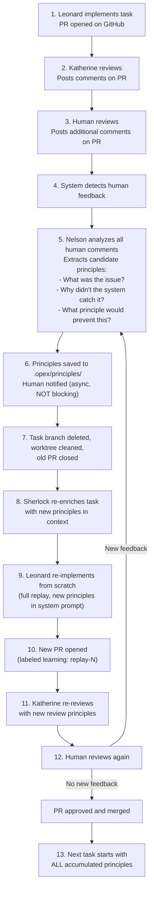

# 03 — Learning & Principles

> **Migrated from**: `docs/specs/01-deployment.md` (Learning Mode, Principle System, Review Threshold & Adaptive Learning sections)

---

## Overview

This spec defines the learning system that allows opex to improve over time
by extracting principles from human feedback. It covers learning mode (the
training phase), the principle system (how learnings are stored and applied),
and the adaptive review threshold (how the system calibrates when to escalate
to humans).

For the review flow that triggers learning, see spec 01.
For Katherine's review scoring, see spec 21.
For the data models (PostgreSQL tables, Pydantic models), see spec 02.

---

## Learning Mode

Learning mode is a training phase where the system learns the team's coding
standards and review expectations through iterative human feedback. Progress
is less important than accumulated principles.

### Configuration

```yaml
# .opex.yaml
learning:
  enabled: true              # Default for new pipelines
  auto_disable_after: null   # Or: 5 (disable after N tasks)
```

Learning mode can be toggled per-pipeline:
- **`.opex.yaml`**: Sets the default for new pipelines.
- **TUI**: `learning off` / `learning on` / `learning status` commands.
- **GitHub**: Add/remove the `learning-mode` label on the feature issue/PR.
  The orchestrator watches for label changes via webhooks.

The pipeline record in PostgreSQL tracks when learning mode was active:

```sql
ALTER TABLE pipelines ADD COLUMN learning_mode BOOLEAN DEFAULT true;
ALTER TABLE pipelines ADD COLUMN learning_disabled_at_task TEXT;
```

### Learning mode flow

When learning mode is active, each task follows an **Extract → Replay → Verify**
loop:



### Cross-task and cross-feature accumulation

Principles accumulate across tasks within a feature and across features:
- Task-2 starts with all principles extracted during task-1.
- A new feature started after feature A benefits from all of feature A's principles.
- Principles live in the target repo (`.opex/principles/`) so they're
  available to every pipeline.

### Mid-feature toggle

A common workflow for large features (e.g., 25 tasks):
1. Start in learning mode.
2. Spend time on the first 3-5 tasks, accumulating principles.
3. Once confident, toggle learning mode off via TUI: `learning off`.
4. Remaining tasks proceed autonomously using accumulated principles.
5. The review threshold (see below) reflects the system's learned confidence.

### Discussion-based learning

In learning mode, the TUI provides a **chat interface** where the human can
discuss principles with Nelson before they're finalized:

```
┌─ Learning Discussion: task-1, principle extraction ──────┐
│                                                           │
│ Nelson: I extracted these candidate principles from your  │
│ review comments:                                          │
│   1. "Always use the repository pattern for data access"  │
│   2. "Error messages must include the operation name"     │
│                                                           │
│ Human: #1 is right but too narrow. We also use the        │
│ repository pattern for cache access, not just DB.         │
│                                                           │
│ Nelson: Updated principle #1: "Always use the repository  │
│ pattern for all data access (database, cache, external    │
│ services). Never access storage directly."                │
│                                                           │
│ Human: Better. Also add an example of what NOT to do.     │
│                                                           │
│ Nelson: Added negative example. Principle #1 now reads... │
│                                                           │
│ Human: /approve                                           │
│                                                           │
│ Nelson: Principles finalized. Replaying task-1...         │
└───────────────────────────────────────────────────────────┘
```

These conversations are stored as **decision records**:

```sql
CREATE TABLE learning_conversations (
    id TEXT PRIMARY KEY,
    pipeline_id TEXT NOT NULL,
    task_id TEXT NOT NULL,
    replay_number INTEGER NOT NULL,         -- Which replay iteration
    messages JSONB NOT NULL,                -- Full conversation thread
    principles_extracted TEXT[],            -- IDs of principles created/updated
    created_at TIMESTAMPTZ NOT NULL DEFAULT NOW(),
    FOREIGN KEY (pipeline_id) REFERENCES pipelines(id)
);
```

Decision records capture: the challenge (what the human flagged), the options
discussed, the final decision, and the resulting principles. These are
inspectable later via the TUI or API for audit and reflection.

---

## Principle System

Principles are the distilled learnings from human feedback. They feed into
agent prompts (Leonard for implementation, Katherine for review) and drive
the adaptive review threshold.

### Storage: repo files + database index

Principles live in **two places**:

1. **Target repo** (`.opex/principles/`) -- version-controlled, human-editable,
   diffable. This is the source of truth.
2. **PostgreSQL** -- indexed for efficient agent queries, with metadata (when
   learned, from which PR, application history, confidence).

### File structure

```
.opex/
  principles/
    implementation/
      impl-001-repository-pattern.md
      impl-002-error-messages.md
      impl-003-dependency-injection.md
    review/
      rev-001-flag-new-dependencies.md
      rev-002-check-sad-path-tests.md
      rev-003-no-raw-sql.md
```

### Principle file format

Each principle file uses YAML frontmatter + markdown body:

```markdown
---
id: impl-001
type: implementation          # "implementation" or "review"
learned_from: PR #101         # Source PR where this was learned
pipeline: pipe-abc123
task: task-1
date: 2026-03-05
agent: leonard                # Which agent this principle applies to
confidence: 0.9               # How consistently this has been applied
replay_count: 2               # How many replays it took to learn
---
# Use repository pattern for all data access

## Principle

Never access storage (database, cache, external services) directly. Always go
through the repository layer defined in `src/repos/`.

## Context

Human reviewer flagged direct SQL query in task-1. The codebase consistently
uses Repository classes for all data access patterns.

## Examples

### Bad
```python
result = await db.execute("SELECT * FROM users WHERE id = $1", user_id)
```

### Good
```python
user = await user_repo.find_by_id(user_id)
```

## Decision record

Challenge: Leonard used raw SQL for a simple query.
Options discussed:
  1. Allow raw SQL for simple queries → Rejected (inconsistent with codebase)
  2. Always use repository pattern → Accepted
Rationale: The codebase has 100% repository pattern usage. Breaking this
convention makes the code harder to maintain and test.
```

### Database index

```sql
CREATE TABLE principles (
    id TEXT PRIMARY KEY,                   -- "impl-001", "rev-003"
    type TEXT NOT NULL,                    -- "implementation" or "review"
    title TEXT NOT NULL,
    content TEXT NOT NULL,                 -- Full markdown content
    agent TEXT NOT NULL,                   -- Target agent
    learned_from_pr TEXT,                  -- GitHub PR URL
    pipeline_id TEXT,
    task_id TEXT,
    confidence REAL DEFAULT 0.5,           -- 0.0 to 1.0
    times_applied INTEGER DEFAULT 0,       -- How many times used in subsequent tasks
    times_violated INTEGER DEFAULT 0,      -- How many times a subsequent task broke this
    created_at TIMESTAMPTZ NOT NULL DEFAULT NOW(),
    updated_at TIMESTAMPTZ NOT NULL DEFAULT NOW()
);

CREATE INDEX idx_principles_type ON principles(type);
CREATE INDEX idx_principles_agent ON principles(agent);
```

### How principles flow into agent prompts

When Sherlock enriches a task (see spec 19):
1. Queries PostgreSQL for all principles matching the agent type.
2. Includes relevant principles in the mini execution plan.
3. Leonard's system prompt includes implementation principles (see spec 20).
4. Katherine's system prompt includes review principles (see spec 21).

When a principle is consistently applied without violations across multiple
tasks, its confidence increases. When it's violated (human catches the same
issue again), confidence decreases and the principle is flagged for review.

---

## Review Threshold & Adaptive Learning

The review threshold controls when Katherine auto-approves a PR versus
flagging it for human review.

### Configuration layers

1. **`.opex.yaml`** (repo owner sets the floor):
   ```yaml
   review:
     confidence_threshold: 0.0      # Floor: system can never go below this
   ```

2. **PostgreSQL** (system learns the current effective threshold):
   ```
   effective_threshold = max(yaml_floor, learned_threshold)
   ```

3. **Threshold history** (full audit trail with reasoning):
   ```sql
   CREATE TABLE review_threshold_history (
       id TEXT PRIMARY KEY,
       timestamp TIMESTAMPTZ NOT NULL DEFAULT NOW(),
       previous_threshold REAL NOT NULL,
       new_threshold REAL NOT NULL,
       reason TEXT NOT NULL,               -- Human-readable explanation
       principles_learned TEXT[],          -- Principle IDs that drove this change
       human_approvals INTEGER NOT NULL,   -- Count since last change
       human_rejections INTEGER NOT NULL,  -- Count since last change
       details JSONB NOT NULL              -- Full reasoning chain:
                                           --   - What comments were made
                                           --   - What principles were extracted
                                           --   - What insights emerged
   );
   ```

### Threshold change reasoning

The threshold doesn't change based on simple approval/rejection counts. It
changes based on **principle accumulation and application**:

```
Threshold increase when:
  - N consecutive tasks applied existing principles without violation
  - Human approved with no new feedback (system "got it right")
  - New principles were applied correctly on first attempt

Threshold decrease when:
  - Human flagged an issue the system should have caught
  - A previously learned principle was violated
  - New principles needed to be extracted (indicates a gap)
```

Each threshold change records the full reasoning chain: what human comments
were made, what principles were involved, what the root cause analysis
revealed, and what the decision was. This is inspectable via the TUI and API.

### Score components (Katherine's confidence scoring)

| Signal              | Source          | Description                                        |
|---------------------|----------------|----------------------------------------------------|
| Novelty             | Nelson          | New patterns, deps, or architectural changes       |
| Complexity          | Heuristics      | Files changed, cyclomatic complexity delta          |
| AI Confidence       | Nelson          | Consensus confidence from the review loop           |
| Historical Accuracy | PostgreSQL      | How often similar PRs needed human intervention    |

### Adaptive threshold

- Initial threshold is set conservatively (flag most PRs for human review).
- Each human decision (approve / request changes) is recorded.
- A lightweight model (logistic regression or similar) is periodically retrained on
  the decision history to recalibrate the threshold.
- The system trends toward flagging fewer PRs as it learns the team's standards.

<!-- TODO: Define the exact logistic regression input features and retraining cadence. -->
