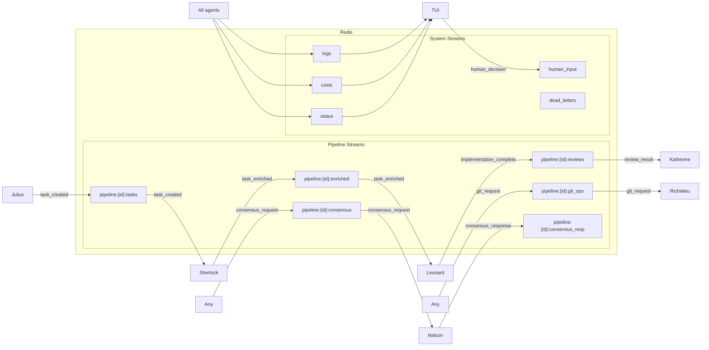
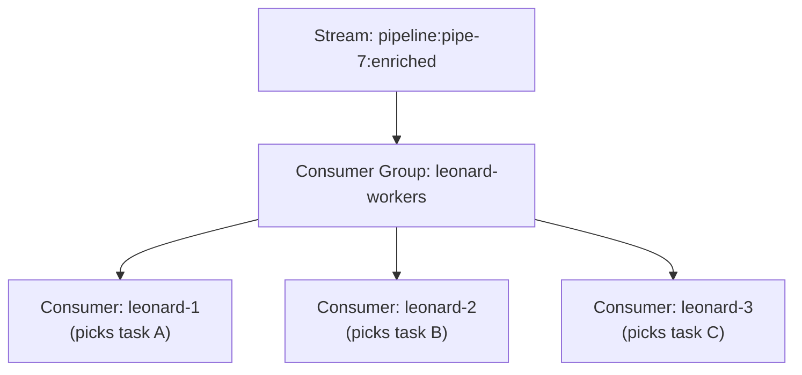

# 04 — Communication Protocol

> **Migrated from**: `docs/specs/10-communication.md` (all content preserved)

---

## Overview

All inter-agent communication flows through Redis Streams. No direct container-to-container
calls. This gives us a single place to monitor, replay, and debug all agent interactions.

---

## Redis Streams Architecture



## Stream Naming Convention

```
{scope}:{identifier}:{channel}
```

- **Pipeline-scoped**: `pipeline:pipe-7:tasks` -- messages for a specific pipeline run.
- **System-scoped**: `logs`, `costs`, `status` -- system-wide streams.

## Consumer Groups

Redis Streams consumer groups enable parallel processing:



- **Single consumer**: Julius, Sherlock, Katherine (one instance each).
- **Consumer group**: Leonard (multiple instances consuming from the same stream).
- **Broadcast**: Logs, costs, status (all TUI instances receive all messages).

## Message Envelope

Every message in every stream uses this envelope:

```python
class MessageEnvelope(BaseModel):
    """Universal message wrapper for all Redis Stream messages."""
    message_id: str                          # UUID (for deduplication)
    message_type: str                        # Discriminator (e.g., "task_created")
    version: int = 1                         # Schema version
    timestamp: datetime
    sender: str                              # Agent name
    pipeline_id: str
    correlation_id: str                      # For tracing across agents
    payload: dict                            # The actual message content (typed per message_type)
    reply_to: str | None = None              # Stream to send response to (for request/response)
```

## Message Types

### Pipeline Messages

#### `task_created` -- Julius → task stream
```python
class TaskCreatedPayload(BaseModel):
    task_id: str
    title: str
    description: str
    dependencies: list[str]                  # Task IDs this depends on
    estimated_complexity: Literal["low", "medium", "high"]
    files_likely_affected: list[str]
    acceptance_criteria: list[str]
```

#### `task_enriched` -- Sherlock → enriched stream
```python
class TaskEnrichedPayload(BaseModel):
    task_id: str
    execution_plan: ExecutionPlan            # Detailed steps
    files_to_modify: list[FileModification]
    files_to_create: list[FileCreation]
    patterns_to_follow: list[CodePattern]
    test_strategy: TestStrategy
    guidelines_applicable: list[str]
```

#### `implementation_complete` -- Leonard → review stream
```python
class ImplementationCompletePayload(BaseModel):
    task_id: str
    branch: str
    worktree_path: str
    files_changed: list[str]
    tests_run: TestResult
    lint_result: LintResult
    commit_sha: str
    attempt_number: int
```

#### `review_result` -- Katherine → appropriate stream
```python
class ReviewResultPayload(BaseModel):
    task_id: str
    decision: Literal["approved", "changes_requested", "escalated"]
    feedback: list[ReviewComment]            # Line-level feedback
    confidence_score: float                   # 0.0 – 1.0 (higher = more confident)
    needs_human_review: bool
    consensus_id: str                        # Nelson consensus that backed this review
```

#### `rework_requested` -- Katherine → Leonard (via review stream)
```python
class ReworkRequestPayload(BaseModel):
    task_id: str
    feedback: list[ReviewComment]
    focus_areas: list[str]                   # What to fix
    previous_attempt: int
```

### Git Operations

#### `git_request` -- Any agent → Richelieu
```python
class GitRequestPayload(BaseModel):
    operation: Literal[
        "create_feature_branch",
        "create_worktree",
        "remove_worktree",
        "merge_branch",
        "open_pr",
        "sync_branch",
    ]
    task_id: str | None
    params: dict                             # Operation-specific parameters
    reply_to: str                            # Stream for Richelieu's response
```

#### `git_response` -- Richelieu → requester
```python
class GitResponsePayload(BaseModel):
    operation: str
    success: bool
    result: dict                             # Operation-specific result
    error: str | None
```

### Consensus Messages

#### `consensus_request` -- Any agent → Nelson
```python
# See spec 16 for full ConsensusRequest model
class ConsensusRequestPayload(BaseModel):
    request_id: str
    requester: str
    prompt: str
    system_context: str | None
    review_goals: list[str] | None
    response_schema: dict | None
    max_rounds: int = 3
    priority: Literal["low", "normal", "high"] = "normal"
```

#### `consensus_response` -- Nelson → requester
```python
# See spec 16 for full ConsensusResponse model
class ConsensusResponsePayload(BaseModel):
    request_id: str
    status: Literal["agreed", "majority", "weighted", "escalated", "error"]
    decision: dict | str
    confidence: float
    reasoning: str
    rounds_taken: int
    total_cost: float
```

### Human Input

#### `human_decision` -- TUI → agents
```python
class HumanDecisionPayload(BaseModel):
    decision_type: Literal[
        "review_approved",
        "review_changes_requested",
        "consensus_override",
        "budget_increase",
        "task_cancelled",
        "guidance_provided",
    ]
    task_id: str | None
    pipeline_id: str
    details: dict                            # Decision-specific data
    message: str | None                      # Human's comment
```

## Message Flow: Complete Task Lifecycle

For the full 20-step end-to-end pipeline flow, see spec 01.

```
1. Julius publishes to `pipeline:X:tasks`:
   {type: "task_created", payload: {task_id: "t1", ...}}

2. Sherlock consumes from `pipeline:X:tasks`:
   Reads task, analyzes codebase, publishes to `pipeline:X:enriched`:
   {type: "task_enriched", payload: {task_id: "t1", execution_plan: ...}}

3. Before Leonard starts, it requests a worktree via `pipeline:X:git_ops`:
   {type: "git_request", payload: {operation: "create_worktree", task_id: "t1"}}

4. Richelieu consumes from `pipeline:X:git_ops`:
   Creates worktree, responds via reply_to stream:
   {type: "git_response", payload: {success: true, result: {path: "/workspace/.worktrees/t1"}}}

5. Leonard consumes from `pipeline:X:enriched` (consumer group):
   Implements code, publishes to `pipeline:X:reviews`:
   {type: "implementation_complete", payload: {task_id: "t1", branch: "opex/...", ...}}

6. Katherine consumes from `pipeline:X:reviews`:
   Requests consensus via `pipeline:X:consensus`:
   {type: "consensus_request", payload: {prompt: "Review this diff...", ...}}

7. Nelson consumes from `pipeline:X:consensus`:
   Runs consensus loop, responds via `pipeline:X:consensus_resp`:
   {type: "consensus_response", payload: {status: "agreed", decision: "approved", ...}}

8. Katherine receives consensus, decides:
   If approved → publishes to `pipeline:X:git_ops`:
   {type: "git_request", payload: {operation: "merge_branch", ...}}

   If changes needed → publishes to `pipeline:X:reviews`:
   {type: "rework_requested", payload: {feedback: [...], ...}}
```

## Dead Letter Queue

Messages that fail processing go to the `dead_letters` stream:

```python
class DeadLetterPayload(BaseModel):
    original_message: MessageEnvelope        # The failed message
    error: str                               # Why it failed
    agent: str                               # Who failed to process it
    attempts: int                            # How many times it was tried
    dead_at: datetime
```

Dead letters are:
- Visible in the TUI.
- Manually retriable via TUI, CLI, or Grafana dashboard.
- Auto-cleaned after 7 days.

## Message Ordering & Delivery Guarantees

- **Within a stream**: Messages are ordered by Redis Stream ID (timestamp-based).
- **Across streams**: No ordering guarantee. Agents use `correlation_id` to track
  related messages.
- **At-least-once delivery**: Redis Streams with `XACK`. If a consumer crashes
  before acknowledging, the message is redelivered.
- **Deduplication**: Agents check `message_id` to avoid processing duplicates
  (especially important after crash recovery).

## Backpressure

If an agent can't keep up with incoming messages:
- Redis Streams accumulate (they're persistent).
- The TUI shows stream depth metrics.
- If a stream exceeds a configurable depth (e.g., 1000 messages), an alert fires.
- No messages are dropped -- the system slows down rather than losing work.
