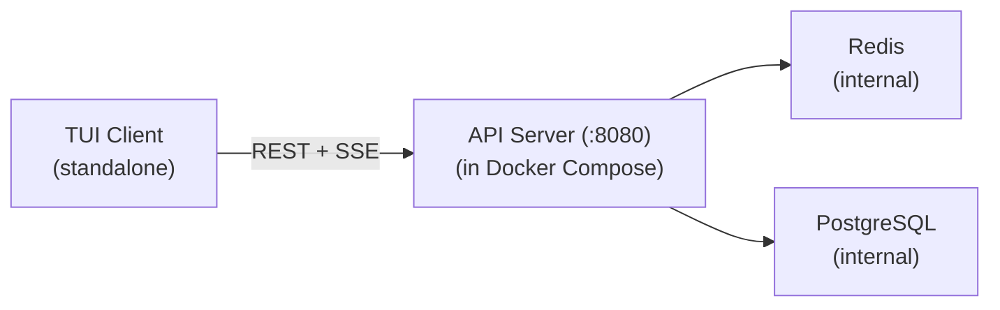

# 14 — API Server

> **Migrated from**: `docs/specs/01-deployment.md` (API Server section, expanded into a full spec)

## Overview

The API server is the **sole external interface** for the TUI client (spec 15) and any
future integrations. It replaces direct Redis/PostgreSQL access from outside
the Docker network.

No external client should ever connect directly to Redis or PostgreSQL. All reads
and writes from outside the Docker Compose network go through this service.

---

## Architecture



The API server is an always-running service defined in the Docker Compose file
(see spec 05). It depends on Redis and PostgreSQL being healthy before starting.

```yaml
# From spec 05 docker-compose.yml
api:
  build: ./api
  ports:
    - "8080:8080"
  env_file: .env
  depends_on:
    redis:
      condition: service_healthy
    postgres:
      condition: service_healthy
  restart: unless-stopped
  logging: *default-logging
```

---

## REST Endpoints (Commands and Queries)

### Pipelines

```
POST   /pipelines                     # Create a new pipeline
GET    /pipelines                     # List all pipelines
GET    /pipelines/:id                 # Pipeline detail (status, tasks, cost)
DELETE /pipelines/:id                 # Cancel a pipeline
POST   /pipelines/:id/cleanup         # Clean up cancelled pipeline (close PRs, delete branches)
```

<!-- TODO: Detailed request/response schemas for pipeline endpoints -->
<!-- TODO:
POST /pipelines request body:
{
  "plan": "string - the human's plan text",
  "repo_url": "string - target repository URL",
  "target_branch": "string - branch to target (default: main)",
  "config_overrides": {} - optional .opex.yaml overrides
}

POST /pipelines response body:
{
  "pipeline_id": "pipe-{uuid}",
  "status": "created",
  "created_at": "ISO 8601 timestamp"
}

GET /pipelines response body:
{
  "pipelines": [
    {
      "id": "pipe-{uuid}",
      "plan": "string",
      "status": "PipelineStatus",
      "task_count": int,
      "tasks_completed": int,
      "pr_url": "string | null",
      "total_cost": float,
      "created_at": "ISO 8601",
      "completed_at": "ISO 8601 | null"
    }
  ]
}

GET /pipelines/:id response body:
{
  ... full pipeline detail including tasks array, dependency graph, cost breakdown
}

DELETE /pipelines/:id response body:
{
  "pipeline_id": "pipe-{uuid}",
  "status": "cancelled"
}
-->

### Task Human Intervention (spec 01 — Human Intervention Flow)

```
GET    /tasks/:id/attempts                # List all attempts for a task
GET    /tasks/:id/context                 # Get full context chain for a task

POST   /tasks/:id/chat                    # Start or continue a diagnostic chat session
GET    /tasks/:id/chat/:session_id        # Get chat session messages
POST   /tasks/:id/chat/:session_id/consensus  # Invoke Nelson consensus from chat

POST   /tasks/:id/retry                   # Add context and retry (Phase 2 approval)
POST   /tasks/:id/takeover                # Human takes over the task
POST   /tasks/:id/complete-external       # Human declares work done → Katherine verifies

PATCH  /pipelines/:id/retries             # Override max_task_retries for a pipeline
```

### Learning Mode

```
POST   /pipelines/:id/learning       # Toggle learning mode {enabled: true/false}
GET    /pipelines/:id/learning        # Learning mode status + principle count
```

<!-- TODO: Detailed request/response schemas for learning mode endpoints -->

### Principles

```
GET    /principles                    # List all principles
GET    /principles/:id                # Principle detail
PUT    /principles/:id                # Human edits a principle
DELETE /principles/:id                # Human removes a principle
```

<!-- TODO: Detailed request/response schemas for principle endpoints -->

### Learning Conversations

```
GET    /conversations                 # List learning conversations
GET    /conversations/:id             # Full conversation thread
POST   /chat                         # Send a message in a learning discussion
```

<!-- TODO: Detailed request/response schemas for conversation endpoints -->

### Attention Queue

```
GET    /attention                     # List all unresolved attention items
DELETE /attention/:id                 # Dismiss an attention item
```

The attention queue is the API server's aggregation of all items that need
human action. The TUI Dashboard (spec 15) renders this as its primary panel.

Items are created when escalation events arrive on `system:escalations` Redis
Stream. Items are auto-resolved when the underlying state changes (task
retried, taken over, pipeline cancelled). Manual dismiss is also available.

Each attention item has a severity level:

| Type | Severity | Trigger |
|------|----------|---------|
| `needs_human` | HIGH | Task enters NEEDS_HUMAN state |
| `review_flagged` | MEDIUM | Katherine flags low confidence |
| `consensus_failed` | MEDIUM | Nelson can't reach agreement |
| `pipeline_partial_fail` | HIGH | Pipeline enters PARTIALLY_FAILED |
| `budget_warning` | LOW | Cost exceeds 80% of limit |
| `budget_critical` | HIGH | Cost exceeds 95% of limit |

### Webhook Configuration

```
GET    /config/notifications          # Get current webhook config
PUT    /config/notifications          # Update webhook config at runtime
```

### System

```
GET    /health                        # API server + infrastructure health
GET    /status                        # Running containers, active pipelines
```

<!-- TODO: Detailed request/response schemas for system endpoints -->

---

## SSE Streams (Real-Time)

Server-Sent Events provide real-time streaming to the TUI client without
requiring WebSocket connections. SSE is simpler, works over HTTP/1.1, and
is natively supported by most HTTP clients.

```
GET    /stream/pipelines              # All pipeline events (status changes)
GET    /stream/pipeline/:id           # Single pipeline events (task progress)
GET    /stream/logs                   # All agent log stream
GET    /stream/logs/:agent            # Specific agent log stream
GET    /stream/learning/:pipeline_id  # Learning mode discussion stream
```

Each SSE stream is backed by a Redis Streams consumer. The API server reads
from the relevant Redis Streams and forwards events to connected SSE clients.

<!-- TODO: SSE event format specification -->
<!-- TODO:
event: pipeline_status
data: {"pipeline_id": "pipe-abc123", "status": "in_progress", "tasks_completed": 2, "total_tasks": 5}

event: task_progress
data: {"task_id": "task-1", "status": "implementing", "agent": "leonard", "elapsed": 45}

event: log_entry
data: {"timestamp": "2026-03-05T14:31:05Z", "level": "INFO", "agent": "leonard", "task": "task-2", "message": "Tests passed (12/12)"}

event: learning_message
data: {"role": "nelson", "content": "I extracted these candidate principles...", "timestamp": "..."}
-->

The `GET /stream/pipelines` endpoint also emits escalation events for the
TUI Attention Queue:

```
event: escalation
data: {"id": "esc-001", "type": "needs_human", "severity": "high",
       "pipeline_id": "pipe-abc123", "pipeline_name": "feature/add-auth",
       "task_id": "task-7", "task_title": "Add JWT middleware",
       "reason": "3 attempts exhausted", "timestamp": "2026-03-02T14:32:05Z"}

event: escalation_resolved
data: {"id": "esc-001", "resolved_by": "retry", "timestamp": "2026-03-02T14:45:00Z"}
```

---

## Webhook Notifications

The API server supports outbound webhook notifications for escalation events.
This enables out-of-band alerting (Slack, email relays, PagerDuty, Discord)
so humans are notified even when the TUI is not open.

### Configuration

Webhook configuration is **deployment-level** (not per-project). It is set
via environment variables in `.env` and can be updated at runtime via the
API:

```bash
# .env
OPEX_WEBHOOK_URL=https://hooks.slack.com/services/T.../B.../xxx
OPEX_WEBHOOK_EVENTS=needs_human,pipeline_partial_fail,budget_critical
OPEX_WEBHOOK_HEADERS=X-Custom-Auth:secret
```

Or via API:

```
PUT /config/notifications
{
  "webhook_url": "https://hooks.slack.com/services/T.../B.../xxx",
  "events": ["needs_human", "pipeline_partial_fail", "budget_critical"],
  "headers": {"X-Custom-Auth": "secret"}
}
```

If `events` is omitted or empty, all escalation events are sent. The
available event types match the attention queue severity table above.

### Webhook payload

```json
{
  "event": "needs_human",
  "severity": "high",
  "pipeline_id": "pipe-abc123",
  "pipeline_name": "feature/add-auth",
  "task_id": "task-7",
  "task_title": "Add JWT middleware",
  "reason": "3 attempts exhausted",
  "timestamp": "2026-03-02T14:32:05Z",
  "attention_id": "esc-001"
}
```

The API server sends a `POST` to the configured URL with a JSON body and
`Content-Type: application/json`. Custom headers from config are included.
Delivery is fire-and-forget with a 5-second timeout. Failed deliveries are
logged but not retried (webhooks are best-effort; the TUI Attention Queue
is the authoritative channel).

### Alternative: Grafana alerting

For teams that prefer ops-native alerting, Grafana (already in the Docker
Compose stack via spec 06) can be configured to alert on Loki log patterns.
Escalation events are logged by the orchestrator as structured log entries
(e.g., `event=needs_human task_id=task-7`), which Grafana can match via
LogQL alerting rules. Grafana natively supports Slack, email, PagerDuty,
and OpsGenie as alert destinations. This approach requires no application
code changes but is documented as an alternative to the built-in webhook
mechanism.

---

## Authentication

Simple token-based auth for now (single-user):

```
Authorization: Bearer <API_TOKEN>
```

The `API_TOKEN` is configured in `.env`. The API server validates the token
on every request. In future, this can be upgraded to OAuth2 or similar for
multi-user access.

<!-- TODO: Authentication implementation details -->
<!-- TODO:
- Token validation middleware
- 401 response format
- Token rotation mechanism
- Future: OAuth2 / OIDC support for multi-user access
-->

---

## Connection String Format

The TUI connects to an AI team via a single connection string:

```
opex://my-team.tailnet.ts.net:8080?token=at-...
```

Or in the TUI config file:

```yaml
# ~/.opex/config.yaml
teams:
  - name: my-app
    url: https://localhost:8080
    token: at-...
  - name: other-project
    url: https://opex-other.tailnet.ts.net:8080
    token: at-...
```

This format supports:
- **Local development**: `https://localhost:8080`
- **Tailscale**: `https://my-team.tailnet.ts.net:8080` (no port forwarding needed)
- **Cloud deployments**: Any HTTPS endpoint

---

## Error Response Format

<!-- TODO: Define standardized error response format -->
<!-- TODO:
All error responses follow a consistent format:

{
  "error": {
    "code": "PIPELINE_NOT_FOUND",
    "message": "Pipeline pipe-abc123 does not exist",
    "details": {}  // Optional additional context
  }
}

HTTP status codes:
- 400: Bad Request (invalid input)
- 401: Unauthorized (missing/invalid token)
- 404: Not Found (pipeline, task, principle not found)
- 409: Conflict (pipeline already cancelled, etc.)
- 422: Unprocessable Entity (valid JSON but invalid semantics)
- 500: Internal Server Error
- 503: Service Unavailable (Redis/PostgreSQL down)
-->

---

## Rate Limiting

<!-- TODO: Rate limiting strategy -->
<!-- TODO:
Rate limiting is deferred for now (single-user system). When multi-user
access is added:
- Per-token rate limits
- Separate limits for read (GET) vs write (POST/PUT/DELETE)
- SSE connections count against a concurrent connection limit
- 429 Too Many Requests response with Retry-After header
-->

---

## WebSocket Upgrade Path

<!-- TODO: WebSocket upgrade for learning discussions -->
<!-- TODO:
SSE is one-directional (server → client). Learning mode discussions require
bidirectional communication (human sends messages, Nelson responds). Currently
this is handled via:
- POST /chat (human → server)
- GET /stream/learning/:pipeline_id (server → human via SSE)

If this proves insufficient (e.g., latency, connection management complexity),
a WebSocket upgrade path should be considered:
- WS /ws/learning/:pipeline_id (bidirectional)
- Evaluate after TUI implementation to see if SSE + REST is sufficient
-->

---

## Deployment Considerations

<!-- TODO: API server deployment details -->
<!-- TODO:
- Framework choice (FastAPI is the likely candidate — async, SSE support, Pydantic integration)
- CORS configuration (for potential future web UI)
- Request logging (structlog, same pattern as agents)
- Graceful shutdown (drain SSE connections, finish in-flight requests)
- Health check endpoint implementation (/health returns Redis + PostgreSQL status)
- The API server is stateless — can be horizontally scaled behind a load balancer
  (see spec 05 Scaling section)
- API server package structure:
  api/
  ├── pyproject.toml
  ├── Dockerfile
  └── src/
      └── api/
          ├── __init__.py
          ├── main.py
          ├── routes/
          │   ├── pipelines.py
          │   ├── learning.py
          │   ├── principles.py
          │   ├── conversations.py
          │   └── system.py
          ├── sse/
          │   ├── pipeline_stream.py
          │   ├── log_stream.py
          │   └── learning_stream.py
          ├── auth.py
          └── config.py
-->

---

## TUI Capabilities Summary

The API server supports the following TUI features (see spec 15 for TUI details):

| Feature                    | API endpoint used                          |
|----------------------------|--------------------------------------------|
| View pipeline status       | `GET /pipelines`, `GET /stream/pipelines`  |
| View task progress         | `GET /pipelines/:id`, `GET /stream/pipeline/:id` |
| Create a new pipeline      | `POST /pipelines`                          |
| Cancel a pipeline          | `DELETE /pipelines/:id`                    |
| Clean up cancelled pipeline| `POST /pipelines/:id/cleanup`              |
| Override retry limit       | `PATCH /pipelines/:id/retries`             |
| Diagnostic chat            | `POST /tasks/:id/chat`, `GET /tasks/:id/chat/:sid` |
| Add context & retry        | `POST /tasks/:id/retry`                    |
| Human takeover             | `POST /tasks/:id/takeover`                 |
| Complete external work     | `POST /tasks/:id/complete-external`        |
| Nelson consensus (in chat) | `POST /tasks/:id/chat/:sid/consensus`      |
| View attempt history       | `GET /tasks/:id/attempts`                  |
| View context chain         | `GET /tasks/:id/context`                   |
| Toggle learning mode       | `POST /pipelines/:id/learning`             |
| Chat with Nelson (learning)| `POST /chat`, `GET /stream/learning/:id`   |
| Browse principles          | `GET /principles`                          |
| Edit principles            | `PUT /principles/:id`                      |
| View learning conversations| `GET /conversations`                       |
| Tail agent logs            | `GET /stream/logs/:agent`                  |
| Attention queue            | `GET /attention`, `DELETE /attention/:id`   |
| Webhook config             | `GET /config/notifications`, `PUT /config/notifications` |
| System health              | `GET /health`, `GET /status`               |

---

## Relationship to Other Specs

| Spec | Relationship |
|------|-------------|
| 05   | Infrastructure spec defines the Docker Compose service entry for the API server, networking, and port exposure |
| 13   | Orchestrator handles internal orchestration; API server handles external access. They share Redis and PostgreSQL but don't communicate directly |
| 15   | TUI is the primary consumer of the API server. All TUI features map to API endpoints listed above |
| 09   | Security spec covers authentication hardening, TLS, and access control for the API |
| 04   | API server reads from Redis Streams to power SSE endpoints |
| 02   | API server reads/writes Pydantic models and PostgreSQL tables defined in spec 02 |
