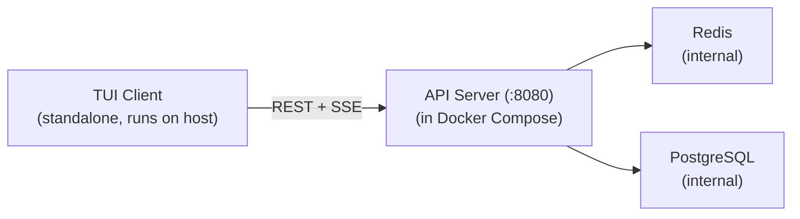
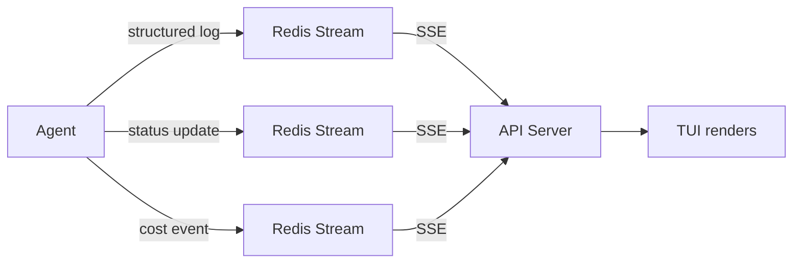

# 15 — TUI (Terminal User Interface)

> **Migrated from**: `docs/specs/03-task-visibility.md` (TUI Screens, Human Escalation, Data Flow) and `docs/specs/01-deployment.md` (TUI Architecture, capabilities table, multi-team view)

## Overview

A terminal UI (TUI) built with [Textual](https://textual.textualize.io/) provides
real-time visibility into what the agents are doing. The TUI is a **standalone client**
that runs on the host machine (not inside Docker) and connects to the API server
(spec 14) via REST + SSE.

The TUI is the primary human interface for monitoring pipelines, viewing agent activity,
managing learning mode, and responding to escalation requests.

---

## Architecture

> **Migrated from**: `docs/specs/01-deployment.md` — TUI Architecture section

The TUI is a **standalone client** that runs on the host (not inside Docker).
It connects to one or more AI team deployments via their API servers.

### Key design decisions

- **Not a Docker Compose service**: The TUI is a pip-installable Python package
  (`pip install ai-team-tui` or `uv tool install ai-team-tui`).
- **Multi-team support**: The TUI can switch between multiple AI team
  deployments. Each team has its own connection string.
- **No direct database access**: The TUI only talks to the API server (spec 14). It
  never connects to Redis or PostgreSQL directly.
- **Real-time via SSE**: Pipeline progress, agent logs, and learning mode
  discussions stream in real-time via Server-Sent Events from the API server.

### Connection model



The TUI uses the connection string format defined in spec 14:

```yaml
# ~/.ai-team/config.yaml
teams:
  - name: my-app
    url: https://localhost:8080
    token: at-...
  - name: other-project
    url: https://ai-team-other.tailnet.ts.net:8080
    token: at-...
```

### TUI capabilities

> **Migrated from**: `docs/specs/01-deployment.md` — TUI capabilities table

| Feature                    | API endpoint used                          |
|----------------------------|--------------------------------------------|
| View pipeline status       | `GET /pipelines`, `GET /stream/pipelines`  |
| View task progress         | `GET /pipelines/:id`, `GET /stream/pipeline/:id` |
| Create a new pipeline      | `POST /pipelines`                          |
| Cancel a pipeline          | `DELETE /pipelines/:id`                    |
| Override retry limit       | `PATCH /pipelines/:id/retries`             |
| Diagnostic chat            | `POST /tasks/:id/chat`, `GET /tasks/:id/chat/:sid` |
| Add context & retry        | `POST /tasks/:id/retry`                    |
| Human takeover             | `POST /tasks/:id/takeover`                 |
| Complete external work     | `POST /tasks/:id/complete-external`        |
| Nelson consensus (in chat) | `POST /tasks/:id/chat/:sid/consensus`      |
| View attempt history       | `GET /tasks/:id/attempts`                  |
| View context chain         | `GET /tasks/:id/context`                   |
| Toggle learning mode       | `POST /pipelines/:id/learning`             |
| Chat with Nelson (learning)| `POST /chat`, `GET /stream/learning/:id`   |
| Browse principles          | `GET /principles`                          |
| Edit principles            | `PUT /principles/:id`                      |
| View learning conversations| `GET /conversations`                       |
| Tail agent logs            | `GET /stream/logs/:agent`                  |
| System health              | `GET /health`, `GET /status`               |

---

## TUI Screens

> **Migrated from**: `docs/specs/03-task-visibility.md` — TUI Screens section
> (Updated to reflect API server architecture: TUI connects to API server, not Redis directly)

### 1. Pipeline Overview (Default Screen)

The main view showing the current state of all active work. Data is sourced from
`GET /pipelines` (initial load) and `GET /stream/pipelines` (real-time updates).

```
┌─ AI-Team Dashboard ──────────────────────────────────── 14:32:05 ─┐
│                                                                    │
│  PIPELINE: feature/add-user-auth ───────────────────────────────── │
│                                                                    │
│  Julius ✓  →  Sherlock ●  →  Leonard ◌ ◌ ◌  →  Katherine ◌       │
│  5 tasks      task-2       pending (3)        waiting              │
│  decomposed   enriching                                            │
│                                                                    │
│  ┌─ Tasks ──────────────────────────────────────────────────────┐  │
│  │  #1  ✓ Add User model + migration       Leonard-1 ✓ merged  │  │
│  │  #2  ● Create auth endpoints             Sherlock  enriching │  │
│  │  #3  ◌ Add JWT middleware                 pending  (needs #2) │  │
│  │  #4  ◌ Write auth integration tests       pending  (needs #3) │  │
│  │  #5  ◌ Update API docs                    pending  (needs #1) │  │
│  └──────────────────────────────────────────────────────────────┘  │
│                                                                    │
│  ┌─ Active Agents ──────────────────────────────────────────────┐  │
│  │  Nelson     idle        last: 2m ago     calls: 12           │  │
│  │  Julius     idle        last: 8m ago     tasks: 5            │  │
│  │  Sherlock   working     task: #2         elapsed: 1m32s      │  │
│  │  Leonard-1  idle        last: 4m ago     completed: 1        │  │
│  │  Katherine  idle        last: 5m ago     reviews: 1          │  │
│  │  Richelieu  idle        last: 30s ago    branches: 2         │  │
│  └──────────────────────────────────────────────────────────────┘  │
│                                                                    │
│  Cost: $2.34 (soft limit: $25.00)  │  Tokens: 142,830            │
│                                                                    │
│  [T]asks  [L]ogs  [C]onsensus  [K]ost  [H]elp  [Q]uit           │
└────────────────────────────────────────────────────────────────────┘
```

### 2. Task Detail View

Drill into a specific task to see its full lifecycle. Data sourced from
`GET /pipelines/:id` and `GET /stream/pipeline/:id`.

```
┌─ Task #2: Create auth endpoints ─────────────────────────────────┐
│                                                                    │
│  Status: enriching (Sherlock)                                      │
│  Dependencies: none                                                │
│  Blocks: #3, #4                                                    │
│  Branch: ai-team/add-user-auth/task-2                             │
│                                                                    │
│  ┌─ Timeline ───────────────────────────────────────────────────┐  │
│  │  14:24:05  Julius    created task                            │  │
│  │  14:24:05  Julius    no dependencies, ready immediately      │  │
│  │  14:28:12  Sherlock  started enrichment                      │  │
│  │  14:28:15  Sherlock  reading src/api/routes/ (4 files)       │  │
│  │  14:29:30  Sherlock  reading src/models/user.py              │  │
│  │  14:30:42  Nelson    consensus: approach for token storage   │  │
│  │            ├─ Claude:  use httpOnly cookies ✓ (agreed)       │  │
│  │            ├─ GPT-4o:  use httpOnly cookies ✓ (agreed)       │  │
│  │            └─ Gemini:  use localStorage ✗ (overruled)        │  │
│  │  14:31:05  Sherlock  execution plan ready (12 steps)         │  │
│  │  ...                                                         │  │
│  └──────────────────────────────────────────────────────────────┘  │
│                                                                    │
│  Cost so far: $0.48  │  Tokens: 31,200                            │
│                                                                    │
│  [B]ack  [E]xecution plan  [C]onsensus history  [L]ogs            │
└────────────────────────────────────────────────────────────────────┘
```

### 3. Log Stream View

Live tail of structured logs, filterable by agent, level, and task.
Data sourced from `GET /stream/logs` and `GET /stream/logs/:agent`.

```
┌─ Logs ─────────── Filter: [agent:all] [level:INFO+] [task:all] ──┐
│                                                                    │
│  14:31:05 INFO  sherlock  task=2  Execution plan generated         │
│  14:31:06 INFO  richelieu task=2  Worktree created at .worktrees/2 │
│  14:31:06 INFO  leonard-1 task=2  Starting implementation          │
│  14:31:08 DEBUG leonard-1 task=2  Reading src/api/routes/auth.py   │
│  14:31:12 DEBUG leonard-1 task=2  LLM call: claude-sonnet tokens=… │
│  14:31:15 INFO  leonard-1 task=2  Created src/api/routes/auth.py   │
│  14:31:18 DEBUG leonard-1 task=2  LLM call: claude-sonnet tokens=… │
│  14:31:22 INFO  leonard-1 task=2  Created tests/test_auth.py       │
│  14:31:25 INFO  leonard-1 task=2  Running: uv run pytest           │
│  14:31:30 INFO  leonard-1 task=2  Tests passed (12/12)             │
│  14:31:31 INFO  leonard-1 task=2  Running: uv run ruff check .     │
│  14:31:32 INFO  leonard-1 task=2  Lint passed                      │
│  14:31:33 INFO  leonard-1 task=2  Implementation complete          │
│  14:31:33 INFO  katherine task=2  Starting review                  │
│  ...                                                               │
│                                                                    │
│  [F]ilter  [P]ause  [B]ack                                        │
└────────────────────────────────────────────────────────────────────┘
```

### 4. Consensus History View

See how LLMs debated and reached (or failed to reach) consensus.
Data sourced from `GET /pipelines/:id` (consensus records).

```
┌─ Consensus History ──────────────────────────────────────────────┐
│                                                                    │
│  ┌─ #7 Code review: task-2 implementation ── AGREED (round 1) ─┐  │
│  │  Requester: Katherine    Confidence: 0.92    Cost: $0.18     │  │
│  │                                                               │  │
│  │  Claude:  APPROVE  "Clean implementation, follows patterns"   │  │
│  │  GPT-4o:  APPROVE  "Good test coverage, minor style nit"     │  │
│  │  Gemini:  APPROVE  "Correct approach, well-structured"       │  │
│  │                                                               │  │
│  │  Result: APPROVED (3/3 agree)                                 │  │
│  └───────────────────────────────────────────────────────────────┘  │
│                                                                    │
│  ┌─ #6 Approach: token storage ── AGREED (round 2) ────────────┐  │
│  │  Requester: Sherlock     Confidence: 0.78    Cost: $0.32     │  │
│  │                                                               │  │
│  │  Round 1: Claude=cookies, GPT-4o=cookies, Gemini=localStorage │  │
│  │  Round 2: Gemini revised → cookies (after reviewing security) │  │
│  │                                                               │  │
│  │  Result: httpOnly cookies (3/3 after round 2)                 │  │
│  └───────────────────────────────────────────────────────────────┘  │
│                                                                    │
│  [B]ack  [D]etail  [F]ilter by agent/outcome                     │
└────────────────────────────────────────────────────────────────────┘
```

### 5. Cost Dashboard

Token usage and cost breakdown. Data sourced from `GET /pipelines/:id`
(cost and token fields).

```
┌─ Cost Dashboard ─────────────────────────────────────────────────┐
│                                                                    │
│  Today: $8.42 / $100.00 daily limit                               │
│  ████████░░░░░░░░░░░░░░░░░░░░░░░░░░░░░░  8.4%                   │
│                                                                    │
│  ┌─ By Agent ───────────────────────────────────────────────────┐  │
│  │  Nelson      $4.20  (consensus calls are expensive)          │  │
│  │  Leonard-1   $1.80                                           │  │
│  │  Sherlock    $1.22                                           │  │
│  │  Katherine   $0.85                                           │  │
│  │  Julius      $0.35                                           │  │
│  │  Richelieu   $0.00  (no LLM calls)                          │  │
│  └──────────────────────────────────────────────────────────────┘  │
│                                                                    │
│  ┌─ By Provider ────────────────────────────────────────────────┐  │
│  │  Claude      $3.40   tokens: 89,200   avg latency: 2.1s     │  │
│  │  GPT-4o     $2.80   tokens: 112,400  avg latency: 1.8s     │  │
│  │  Gemini      $2.22   tokens: 98,600   avg latency: 1.5s     │  │
│  └──────────────────────────────────────────────────────────────┘  │
│                                                                    │
│  ┌─ By Task ────────────────────────────────────────────────────┐  │
│  │  #1  Add User model          $2.10  ✓ completed              │  │
│  │  #2  Create auth endpoints   $3.80  ● in progress            │  │
│  │  #3  Add JWT middleware      $0.00  ◌ pending                │  │
│  │  #4  Write auth tests        $0.00  ◌ pending                │  │
│  │  #5  Update API docs         $2.52  ✓ completed              │  │
│  └──────────────────────────────────────────────────────────────┘  │
│                                                                    │
│  [B]ack  [H]ourly chart  [W]eekly summary                        │
└────────────────────────────────────────────────────────────────────┘
```

### 6. Multi-Team View

> **Migrated from**: `docs/specs/01-deployment.md` — Multi-team view mockup

Switch between multiple AI team deployments. Each team has its own
connection string and independent pipeline state.

```
┌─ AI Teams ──────────────────────────────────────────────┐
│                                                          │
│  [*] my-app         (3 pipelines, 2 active, 12 principles)
│  [ ] other-project  (1 pipeline, idle, 4 principles)    │
│                                                          │
├─ my-app: Pipelines ─────────────────────────────────────┤
│                                                          │
│  pipe-abc  feature/add-auth   IN_PROGRESS  3/5 tasks    │
│  pipe-def  feature/fix-perf   LEARNING     1/3 tasks    │
│  pipe-ghi  feature/refactor   COMPLETED    PR #42       │
│                                                          │
├─ pipe-def: Learning Mode ────────────────────────────────┤
│                                                          │
│  Task: task-1 (replay 2)                                 │
│  Principles extracted: 3                                 │
│  Status: Awaiting human review on PR #105                │
│                                                          │
│  > learning off                                          │
│  > learning status                                       │
│  > chat                                                  │
│                                                          │
└──────────────────────────────────────────────────────────┘
```

---

## Human Escalation Points

> **Migrated from**: `docs/specs/03-task-visibility.md` — Human Escalation Points section

When agents need human input, the TUI shows a notification banner:

```
┌─ ⚠ ATTENTION NEEDED ──────────────────────────────────────────────┐
│                                                                    │
│  1. Katherine flagged PR #42 for human review (score: 0.82)       │
│  2. Nelson couldn't reach consensus on database schema approach    │
│  3. Task #7 needs human guidance (3 attempts failed)              │
│                                                                    │
│  Press [1] [2] [3] to view details, [D]ismiss                    │
└────────────────────────────────────────────────────────────────────┘
```

Escalation events arrive via `GET /stream/pipelines` SSE stream from the API
server (spec 14). The TUI maintains a notification queue and displays the banner
when there are unresolved escalations.

### Human Intervention Actions

When a task is in `NEEDS_HUMAN` state, the TUI presents three options:

```
┌─ Task #7: Add JWT middleware ── NEEDS HUMAN ─────────────────────┐
│                                                                    │
│  Attempts: 3/3 exhausted                                          │
│  Last failure: "Cannot find User model import path"               │
│                                                                    │
│  [I]nvestigate     Start diagnostic chat (discuss what's wrong)   │
│  [T]ake over       Do it yourself, come back when done            │
│  [C]ancel pipeline Drop the entire feature                        │
│                                                                    │
│  [A]ttempt history  View all 3 attempts (logs, diffs, errors)     │
│  [X] Context chain  View accumulated context for this task        │
└────────────────────────────────────────────────────────────────────┘
```

### Diagnostic Chat View

The diagnostic chat is a two-phase interaction for investigating failures
and adding context. See spec 01 — Human Intervention Flow for the full
design. The TUI provides:

- **Phase 1 — Chat mode**: Conversational interface with the LLM, with
  access to attempt history, logs, and codebase context. Human can invoke
  `[N]elson consensus` at any point for multi-model validation.
- **Phase 2 — Context distillation mode**: Review mode showing the proposed
  context addition or task edit with a **diff view** (before/after). Human
  reviews and either `[A]pproves` (triggers retry) or `[E]dits` further.

```
┌─ Diagnostic Chat: Task #7 ── Phase 1 ───────────────────────────┐
│                                                                    │
│  LLM: Looking at attempt 3, Leonard failed because it couldn't   │
│  find the User model. The import path `models.user.User` doesn't │
│  exist. Looking at the codebase...                                │
│                                                                    │
│  LLM: The User model was moved to `auth/models.py` in a recent  │
│  refactor. Leonard was using the old path.                        │
│                                                                    │
│  Human: Yes, we moved it last week. Also, there's a UserProfile  │
│  model in the same file that task-3 will need.                    │
│                                                                    │
│  [N]elson consensus  [S]witch to context mode  [Q]uit chat       │
└────────────────────────────────────────────────────────────────────┘

┌─ Context Distillation: Task #7 ── Phase 2 ──────────────────────┐
│                                                                    │
│  Proposed context addition:                                       │
│  ┌──────────────────────────────────────────────────────────────┐  │
│  │ The User model was moved from models/user.py to             │  │
│  │ auth/models.py. Import as `from auth.models import User,    │  │
│  │ UserProfile`. Both models are needed for JWT middleware.     │  │
│  └──────────────────────────────────────────────────────────────┘  │
│                                                                    │
│  Context chain (cumulative):                                      │
│    1. [original] JWT middleware task description (by julius)       │
│    2. [human_addition] ← NEW (triggered by attempt #3)           │
│                                                                    │
│  [A]pprove & retry  [E]dit  [B]ack to chat  [C]ancel             │
└────────────────────────────────────────────────────────────────────┘
```

### Diff View Capability

The TUI supports **diff views** for comparing before/after states. This is
used in:
- Context distillation (context chain before vs. after addition)
- Task description editing (original vs. modified description)
- Attempt comparison (diff from attempt 1 vs. attempt 2)

Diff rendering uses Textual's built-in rich text capabilities with
side-by-side or unified diff format, color-coded additions/deletions.

---

## Data Flow

> **Migrated from**: `docs/specs/03-task-visibility.md` — Data Flow for TUI section
> (Updated: TUI connects to API server, not Redis directly)

The TUI receives real-time updates via the API server's SSE endpoints:



The TUI is read-only for most operations — it observes pipeline progress via SSE.
Human input (approve, reject, provide guidance, learning mode chat) is sent via
REST endpoints (`POST /chat`, `DELETE /pipelines/:id`, etc.) to the API server,
which publishes to the appropriate Redis Streams for agents to consume.

---

## GitHub-Side Visibility

> **Migrated from**: `docs/specs/03-task-visibility.md` — GitHub-Side Visibility section

In addition to the TUI, the system provides visibility through GitHub:

- **Issue labels**: Applied by agents to show task status (see spec 01).
- **PR descriptions**: Include a summary of what agents did, which tasks are covered,
  consensus decisions made, and the human review score.
- **PR comments**: Katherine posts review findings as PR comments.
- **Status checks**: Leonard reports test/lint results as GitHub status checks.

---

## Grafana / Loki (Separate from TUI)

For historical log querying and dashboards, **Grafana + Loki** are available as a
separate observability layer. All container logs are shipped to Loki automatically
via Docker's Loki logging driver (see spec 05).

Grafana complements the TUI:
- **TUI**: Real-time streaming view, quick task status, human escalation prompts.
- **Grafana**: Historical querying (LogQL), cross-agent correlation, dashboards,
  alerting, and long-term trend analysis.

Grafana is accessed directly via browser at `http://localhost:3000` when the stack
is running. It is not part of the TUI — it is a separate tool.

---

## Learning Mode Chat Interface

<!-- TODO: Detailed UX spec for learning mode chat -->
<!-- TODO:
The learning mode chat provides a bidirectional conversation interface where
the human discusses principles with Nelson.

Key UX requirements:
- Chat messages stream in real-time via GET /stream/learning/:pipeline_id
- Human sends messages via POST /chat
- Nelson's responses appear as they are generated
- Principles extracted during the conversation are highlighted
- /approve command finalizes principles and triggers replay
- /reject command discards candidate principles
- /edit <principle_id> opens inline editing of a principle
- Conversation history is scrollable and searchable
- Visual distinction between Nelson's messages, human messages, and system messages

Mockup:
┌─ Learning Discussion: task-1, principle extraction ──────┐
│                                                           │
│ Nelson: I extracted these candidate principles from your  │
│ review comments:                                          │
│   1. "Always use the repository pattern for data access"  │
│   2. "Error messages must include the operation name"     │
│                                                           │
│ Human: #1 is right but too narrow. We also use the        │
│ repository pattern for cache access, not just DB.         │
│                                                           │
│ Nelson: Updated principle #1: "Always use the repository  │
│ pattern for all data access (database, cache, external    │
│ services). Never access storage directly."                │
│                                                           │
│ Human: Better. Also add an example of what NOT to do.     │
│                                                           │
│ Nelson: Added negative example. Principle #1 now reads... │
│                                                           │
│ Human: /approve                                           │
│                                                           │
│ Nelson: Principles finalized. Replaying task-1...         │
│                                                           │
│ > _                                                       │
└───────────────────────────────────────────────────────────┘
-->

---

## Keybindings

<!-- TODO: Complete keybinding reference -->
<!-- TODO:
Global keybindings (available on all screens):
- Q / Ctrl+C: Quit
- ?: Show help overlay
- Tab: Cycle through panels
- 1-9: Switch to team N (multi-team mode)

Pipeline Overview:
- T: Focus tasks panel
- L: Switch to log stream view
- C: Switch to consensus history view
- K: Switch to cost dashboard
- Enter: Open task detail for selected task
- N: Create new pipeline
- X: Cancel selected pipeline (with confirmation)

Task Detail:
- B: Back to pipeline overview
- E: Show execution plan
- C: Show consensus history for this task
- L: Show logs filtered to this task

Log Stream:
- F: Open filter dialog
- P: Pause/resume log streaming
- B: Back to pipeline overview
- /: Search in logs

Cost Dashboard:
- H: Toggle hourly chart
- W: Show weekly summary
- B: Back to pipeline overview

Learning Mode:
- Enter: Send message
- Ctrl+A: Approve all principles (/approve)
- Ctrl+R: Reject all principles (/reject)
- Ctrl+E: Edit selected principle
- Esc: Exit learning mode chat
-->

---

## Principle Browser View

<!-- TODO: Principle browser UX spec -->
<!-- TODO:
A dedicated view for browsing, searching, and editing accumulated principles.
Data sourced from GET /principles.

Features:
- List all principles grouped by type (implementation / review)
- Search/filter by keyword, agent, confidence level
- View principle detail (full markdown content, metadata, application history)
- Inline editing (PUT /principles/:id)
- Delete with confirmation (DELETE /principles/:id)
- Sort by: date learned, confidence, times applied, times violated
- Visual indicator for principles with declining confidence

Mockup:
┌─ Principles ─────────────────────────────────────────────┐
│                                                           │
│  Filter: [type:all] [agent:all] [search: _______]        │
│                                                           │
│  Implementation (8 principles)                            │
│  ├─ impl-001  Repository pattern for data access   0.95  │
│  ├─ impl-002  Error messages include operation     0.88  │
│  ├─ impl-003  Dependency injection for services    0.82  │
│  └─ ...                                                   │
│                                                           │
│  Review (5 principles)                                    │
│  ├─ rev-001   Flag new dependencies               0.90   │
│  ├─ rev-002   Check sad-path tests                0.75   │
│  └─ ...                                                   │
│                                                           │
│  [Enter] Detail  [E]dit  [D]elete  [B]ack               │
└───────────────────────────────────────────────────────────┘
-->

---

## Conversation History Viewer

<!-- TODO: Conversation history viewer UX spec -->
<!-- TODO:
A view for browsing past learning conversations.
Data sourced from GET /conversations.

Features:
- List all conversations, ordered by date
- Show pipeline, task, replay number for each
- Preview first/last message
- Click to view full conversation thread
- Show which principles were extracted from each conversation
- Link to related PRs on GitHub

Mockup:
┌─ Learning Conversations ─────────────────────────────────┐
│                                                           │
│  pipe-abc / task-1 / replay 1     3 messages, 2 principles│
│    "Repository pattern: updated scope to include cache"   │
│                                                           │
│  pipe-abc / task-1 / replay 2     5 messages, 1 principle │
│    "Error handling: added negative example for task-1"    │
│                                                           │
│  pipe-abc / task-2 / replay 1     2 messages, 0 principles│
│    "No new principles needed - existing ones covered it"  │
│                                                           │
│  [Enter] View thread  [B]ack                             │
└───────────────────────────────────────────────────────────┘
-->

---

## Relationship to Other Specs

| Spec | Relationship |
|------|-------------|
| 05   | Infrastructure spec defines that the TUI is NOT a Docker Compose service — it runs standalone on the host |
| 06   | Orchestrator publishes pipeline events that the TUI consumes via API server SSE |
| 07   | API server is the sole interface the TUI connects to. All TUI features map to API endpoints |
| 09   | Security spec covers TUI authentication (API token), connection security |
| 10   | Redis Streams protocol — the TUI does not read Redis directly; it reads via API server SSE |
